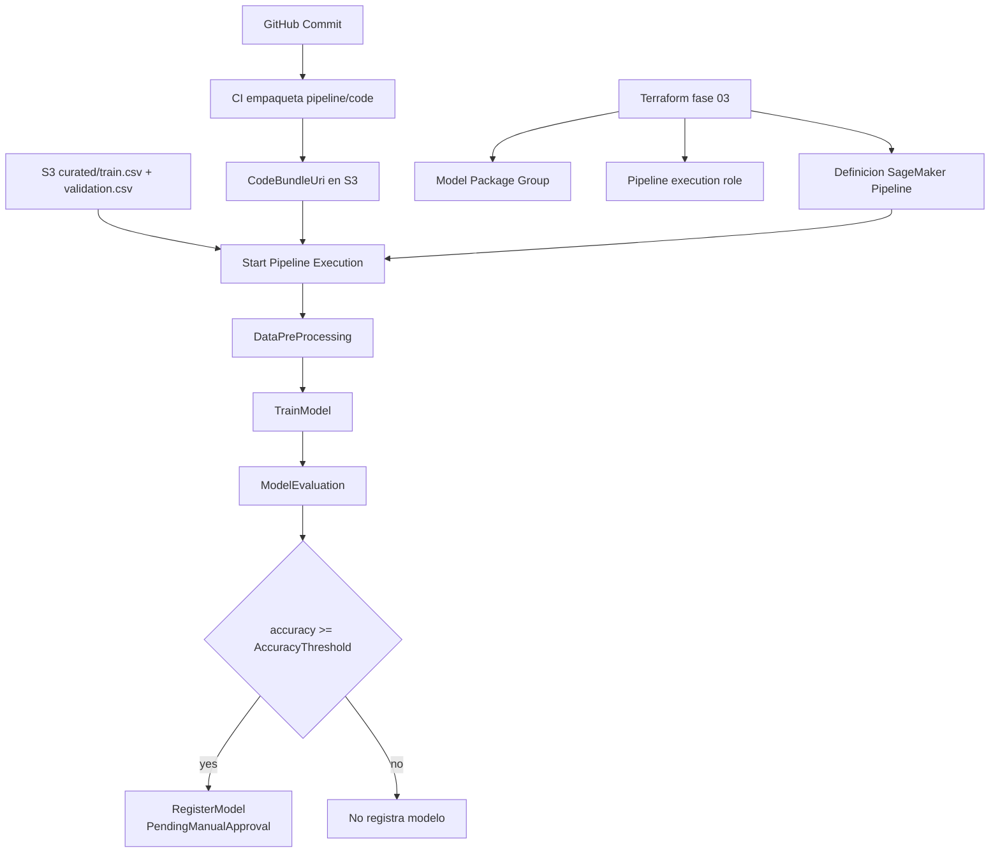

# 03 SageMaker Pipeline

## Objetivo y contexto
Construir el flujo MLOps canonico de `ModelBuild` en SageMaker Pipelines:
`DataPreProcessing -> TrainModel -> ModelEvaluation -> RegisterModel`.

Esta fase usa SageMaker gestionado para ejecucion de steps y mantiene separacion estricta:
1. Terraform despliega recursos estables (IAM, Model Package Group, definicion de pipeline).
2. La ejecucion del pipeline crea recursos runtime (processing/training/evaluation jobs, artefactos y versiones de model package).
3. Las entradas externas de datos son solo:
   - `s3://.../curated/train.csv`
   - `s3://.../curated/validation.csv`
4. No se usa contenedor propio en ECR en esta fase.

## Resultado minimo esperado
1. Infraestructura Terraform de fase 03 creada y versionada.
2. Pipeline de SageMaker publicado y ejecutable.
3. Ejecucion de pipeline con pasos completados en orden.
4. Registro de modelo en Model Registry cuando cumple el umbral (`accuracy >= 0.78`) con `PendingManualApproval`.

## Fuentes oficiales (SageMaker DG) usadas en esta fase
1. `https://sagemaker.readthedocs.io/en/stable/workflows/pipelines/sagemaker.workflow.pipelines.html`
2. `https://sagemaker.readthedocs.io/en/stable/workflows/pipelines/sagemaker.workflow.pipelines.html#sagemaker.workflow.steps.ProcessingStep`
3. `https://sagemaker.readthedocs.io/en/stable/workflows/pipelines/sagemaker.workflow.pipelines.html#sagemaker.workflow.steps.TrainingStep`
4. `https://sagemaker.readthedocs.io/en/stable/workflows/pipelines/sagemaker.workflow.pipelines.html#sagemaker.workflow.condition_step.ConditionStep`
5. `https://sagemaker.readthedocs.io/en/stable/workflows/pipelines/sagemaker.workflow.pipelines.html#sagemaker.workflow.step_collections.RegisterModel`
6. `https://docs.aws.amazon.com/sagemaker/latest/APIReference/API_StartPipelineExecution.html`
7. `https://docs.aws.amazon.com/sagemaker/latest/APIReference/API_DescribePipelineExecution.html`
8. `https://docs.aws.amazon.com/sagemaker/latest/APIReference/API_ListPipelineExecutionSteps.html`
9. `https://docs.aws.amazon.com/sagemaker/latest/APIReference/API_RetryPipelineExecution.html`
10. `https://docs.aws.amazon.com/sagemaker/latest/APIReference/API_StopPipelineExecution.html`
11. `https://docs.aws.amazon.com/sagemaker/latest/dg/model-registry.html`
12. `https://docs.aws.amazon.com/sagemaker/latest/APIReference/API_DescribeModelPackage.html`

## Regla de implementacion de notebook (SDK-first)
La notebook de esta fase debe priorizar `sagemaker` (version mayor 3) como API principal.

Reglas:
1. Usar `sagemaker` v3 para session, definicion/ejecucion de pipeline y registro de modelo.
2. Usar `boto3` solo cuando una operacion no este cubierta claramente por el SDK o para diagnostico.
3. Cuando se use `boto3`, documentar en la celda el motivo y el recurso afectado.
4. Operar con identidad base `data-science-user`.

## Contrato de pipeline (parametros, entradas, gate de calidad)
### Parametros obligatorios
| Parametro | Tipo | Default recomendado | Proposito |
|---|---|---|---|
| `CodeBundleUri` | String | `s3://<bucket>/pipeline/code/<git_sha>/pipeline_code.tar.gz` | Bundle de codigo versionado por commit |
| `InputTrainUri` | String | `s3://<bucket>/curated/train.csv` | Entrada de train |
| `InputValidationUri` | String | `s3://<bucket>/curated/validation.csv` | Entrada de validation |
| `AccuracyThreshold` | Float | `0.78` | Umbral de gate para registro |

### Gate de calidad
1. `ModelEvaluation` debe emitir `evaluation.json` con ruta JSON `metrics.accuracy`.
2. `ConditionStep` compara `metrics.accuracy` contra `AccuracyThreshold`.
3. Si cumple, se ejecuta `RegisterModel` con `PendingManualApproval`.

### Split Terraform vs runtime (obligatorio)
1. Terraform despliega recursos estables:
   - role/policies,
   - model package group,
   - `aws_sagemaker_pipeline`.
2. La ejecucion del pipeline crea recursos runtime:
   - processing/training/evaluation jobs,
   - artefactos en S3,
   - versiones de model package.

## Arquitectura end-to-end (Mermaid)


## Workshop notebook paso a paso (celdas ejecutables)
Prerequisito local de codigo antes de correr celdas:
1. Deben existir en repo:
   - `pipeline/code/preprocess.py`
   - `pipeline/code/train.py` (si aplica)
   - `pipeline/code/evaluate.py`
2. `preprocess.py` debe escribir salidas en:
   - `/opt/ml/processing/output/train`
   - `/opt/ml/processing/output/validation`
3. `evaluate.py` debe escribir `/opt/ml/processing/evaluation/evaluation.json` con:
```json
{
  "metrics": {
    "accuracy": 0.81,
    "precision": 0.80,
    "recall": 0.79,
    "f1": 0.79
  }
}
```

### Celda 00 - imports y version de SDK
```python
import os
import time
import json
import uuid

import boto3
import sagemaker

from sagemaker.workflow.pipeline_context import PipelineSession
from sagemaker.workflow.pipeline import Pipeline
from sagemaker.workflow.parameters import ParameterString, ParameterFloat
from sagemaker.workflow.steps import ProcessingStep, TrainingStep, CacheConfig
from sagemaker.workflow.step_collections import RegisterModel
from sagemaker.workflow.condition_step import ConditionStep
from sagemaker.workflow.conditions import ConditionGreaterThanOrEqualTo
from sagemaker.workflow.functions import JsonGet
from sagemaker.workflow.properties import PropertyFile

from sagemaker.processing import ScriptProcessor, ProcessingInput, ProcessingOutput
from sagemaker.estimator import Estimator
from sagemaker.inputs import TrainingInput
from sagemaker.model_metrics import ModelMetrics, MetricsSource
from sagemaker.image_uris import retrieve

assert sagemaker.__version__.split(".")[0] == "3", sagemaker.__version__
```

### Celda 01 - bootstrap de profile/region/session
```python
AWS_PROFILE = os.getenv("AWS_PROFILE", "data-science-user")
AWS_REGION = os.getenv("AWS_REGION", "eu-west-1")

boto_session = boto3.session.Session(profile_name=AWS_PROFILE, region_name=AWS_REGION)
sm_client = boto_session.client("sagemaker")
s3_client = boto_session.client("s3")
pipeline_session = PipelineSession(boto_session=boto_session, sagemaker_client=sm_client)

# Debe apuntar al role de ejecucion de SageMaker Pipeline creado por Terraform.
PIPELINE_EXEC_ROLE_ARN = os.environ["SAGEMAKER_PIPELINE_ROLE_ARN"]

print(AWS_PROFILE, AWS_REGION)
print(PIPELINE_EXEC_ROLE_ARN)
```

### Celda 02 - variables base y URIs
```python
DATA_BUCKET = os.environ["DATA_BUCKET"]
GIT_SHA = os.getenv("GIT_SHA", "manual-" + uuid.uuid4().hex[:8])

PIPELINE_NAME = os.getenv("PIPELINE_NAME", "titanic-modelbuild-dev")
MODEL_PACKAGE_GROUP_NAME = os.getenv("MODEL_PACKAGE_GROUP_NAME", "titanic-survival-xgboost")

CODE_BUNDLE_URI_DEFAULT = f"s3://{DATA_BUCKET}/pipeline/code/{GIT_SHA}/pipeline_code.tar.gz"
INPUT_TRAIN_URI_DEFAULT = f"s3://{DATA_BUCKET}/curated/train.csv"
INPUT_VALIDATION_URI_DEFAULT = f"s3://{DATA_BUCKET}/curated/validation.csv"
RUNTIME_PREFIX = f"s3://{DATA_BUCKET}/pipeline/runtime/{PIPELINE_NAME}"
```

### Celda 03 - declaracion del contrato de parametros
```python
param_code_bundle_uri = ParameterString(name="CodeBundleUri", default_value=CODE_BUNDLE_URI_DEFAULT)
param_input_train_uri = ParameterString(name="InputTrainUri", default_value=INPUT_TRAIN_URI_DEFAULT)
param_input_validation_uri = ParameterString(name="InputValidationUri", default_value=INPUT_VALIDATION_URI_DEFAULT)
param_accuracy_threshold = ParameterFloat(name="AccuracyThreshold", default_value=0.78)
```

### Celda 04 - ProcessingStep para DataPreProcessing
```python
cache_config = CacheConfig(enable_caching=True, expire_after="30d")

sklearn_image_uri = retrieve(
    framework="sklearn",
    region=AWS_REGION,
    version="1.2-1",
    image_scope="training",
    instance_type="ml.m5.large",
)

preprocess_processor = ScriptProcessor(
    role=PIPELINE_EXEC_ROLE_ARN,
    image_uri=sklearn_image_uri,
    command=["python3"],
    instance_count=1,
    instance_type="ml.m5.large",
    sagemaker_session=pipeline_session,
)

preprocess_step_args = preprocess_processor.run(
    code="pipeline/code/preprocess.py",
    arguments=[
        "--input-train-uri", param_input_train_uri,
        "--input-validation-uri", param_input_validation_uri,
        "--output-prefix", f"{RUNTIME_PREFIX}/preprocess",
        "--code-bundle-uri", param_code_bundle_uri,
    ],
    outputs=[
        ProcessingOutput(output_name="train", source="/opt/ml/processing/output/train"),
        ProcessingOutput(output_name="validation", source="/opt/ml/processing/output/validation"),
    ],
)

step_preprocess = ProcessingStep(
    name="DataPreProcessing",
    step_args=preprocess_step_args,
    cache_config=cache_config,
)
```

### Celda 05 - TrainingStep
```python
xgb_image_uri = retrieve(
    framework="xgboost",
    region=AWS_REGION,
    version="1.7-1",
    image_scope="training",
    instance_type="ml.m5.large",
)

xgb_estimator = Estimator(
    image_uri=xgb_image_uri,
    role=PIPELINE_EXEC_ROLE_ARN,
    instance_count=1,
    instance_type="ml.m5.large",
    output_path=f"{RUNTIME_PREFIX}/training",
    sagemaker_session=pipeline_session,
)

xgb_estimator.set_hyperparameters(
    objective="binary:logistic",
    num_round=200,
    max_depth=5,
    eta=0.2,
    subsample=0.8,
    eval_metric="logloss",
)

training_step_args = xgb_estimator.fit(
    inputs={
        "train": TrainingInput(
            s3_data=step_preprocess.properties.ProcessingOutputConfig.Outputs["train"].S3Output.S3Uri,
            content_type="text/csv",
        ),
        "validation": TrainingInput(
            s3_data=step_preprocess.properties.ProcessingOutputConfig.Outputs["validation"].S3Output.S3Uri,
            content_type="text/csv",
        ),
    }
)

step_train = TrainingStep(
    name="TrainModel",
    step_args=training_step_args,
    cache_config=cache_config,
)
```

### Celda 06 - ProcessingStep de evaluacion + extraccion de accuracy
```python
evaluate_processor = ScriptProcessor(
    role=PIPELINE_EXEC_ROLE_ARN,
    image_uri=sklearn_image_uri,
    command=["python3"],
    instance_count=1,
    instance_type="ml.m5.large",
    sagemaker_session=pipeline_session,
)

evaluation_report = PropertyFile(
    name="EvaluationReport",
    output_name="evaluation",
    path="evaluation.json",
)

evaluate_step_args = evaluate_processor.run(
    code="pipeline/code/evaluate.py",
    arguments=[
        "--accuracy-threshold", param_accuracy_threshold,
    ],
    inputs=[
        ProcessingInput(
            source=step_train.properties.ModelArtifacts.S3ModelArtifacts,
            destination="/opt/ml/processing/model",
        ),
        ProcessingInput(
            source=step_preprocess.properties.ProcessingOutputConfig.Outputs["validation"].S3Output.S3Uri,
            destination="/opt/ml/processing/validation",
        ),
    ],
    outputs=[
        ProcessingOutput(output_name="evaluation", source="/opt/ml/processing/evaluation"),
    ],
)

step_evaluate = ProcessingStep(
    name="ModelEvaluation",
    step_args=evaluate_step_args,
    property_files=[evaluation_report],
    cache_config=cache_config,
)
```

### Celda 07 - ConditionStep + RegisterModel
```python
model_metrics = ModelMetrics(
    model_statistics=MetricsSource(
        s3_uri=(
            step_evaluate.properties
            .ProcessingOutputConfig
            .Outputs["evaluation"]
            .S3Output
            .S3Uri
            + "/evaluation.json"
        ),
        content_type="application/json",
    )
)

register_model_step = RegisterModel(
    name="RegisterModel",
    estimator=xgb_estimator,
    model_data=step_train.properties.ModelArtifacts.S3ModelArtifacts,
    content_types=["text/csv"],
    response_types=["text/csv"],
    inference_instances=["ml.m5.large"],
    transform_instances=["ml.m5.large"],
    model_package_group_name=MODEL_PACKAGE_GROUP_NAME,
    approval_status="PendingManualApproval",
    model_metrics=model_metrics,
)

accuracy_condition = ConditionGreaterThanOrEqualTo(
    left=JsonGet(
        step_name=step_evaluate.name,
        property_file=evaluation_report,
        json_path="metrics.accuracy",
    ),
    right=param_accuracy_threshold,
)

step_quality_gate = ConditionStep(
    name="QualityGateAccuracy",
    conditions=[accuracy_condition],
    if_steps=[register_model_step],
    else_steps=[],
)
```

### Celda 08 - create/upsert del pipeline
```python
pipeline = Pipeline(
    name=PIPELINE_NAME,
    parameters=[
        param_code_bundle_uri,
        param_input_train_uri,
        param_input_validation_uri,
        param_accuracy_threshold,
    ],
    steps=[step_preprocess, step_train, step_evaluate, step_quality_gate],
    sagemaker_session=pipeline_session,
)

upsert_response = pipeline.upsert(role_arn=PIPELINE_EXEC_ROLE_ARN)
print(json.dumps(upsert_response, indent=2, default=str))
```

### Celda 09 - start de ejecucion
```python
execution = pipeline.start(
    parameters={
        "CodeBundleUri": CODE_BUNDLE_URI_DEFAULT,
        "InputTrainUri": INPUT_TRAIN_URI_DEFAULT,
        "InputValidationUri": INPUT_VALIDATION_URI_DEFAULT,
        "AccuracyThreshold": 0.78,
    }
)

PIPELINE_EXECUTION_ARN = execution.arn
print(PIPELINE_EXECUTION_ARN)
```

### Celda 10 - monitoreo de ejecucion y steps
```python
terminal_statuses = {"Succeeded", "Failed", "Stopped"}

while True:
    desc = sm_client.describe_pipeline_execution(PipelineExecutionArn=PIPELINE_EXECUTION_ARN)
    status = desc["PipelineExecutionStatus"]
    print(f"Pipeline status: {status}")

    steps_resp = sm_client.list_pipeline_execution_steps(
        PipelineExecutionArn=PIPELINE_EXECUTION_ARN,
        SortOrder="Ascending",
    )
    for item in steps_resp.get("PipelineExecutionSteps", []):
        print(item.get("StepName"), "->", item.get("StepStatus"))

    if status in terminal_statuses:
        break
    time.sleep(30)

assert status == "Succeeded", f"Pipeline finalizo en {status}"
```

### Celda 11 - verificacion final en Model Registry
```python
# boto3 fallback intencional: inspeccion detallada de packages registrados.
packages = sm_client.list_model_packages(
    ModelPackageGroupName=MODEL_PACKAGE_GROUP_NAME,
    SortBy="CreationTime",
    SortOrder="Descending",
    MaxResults=5,
)["ModelPackageSummaryList"]

assert len(packages) > 0, "No hay ModelPackage en el grupo"
latest_model_package_arn = packages[0]["ModelPackageArn"]

mp_desc = sm_client.describe_model_package(ModelPackageName=latest_model_package_arn)
print("ModelPackageArn:", latest_model_package_arn)
print("ModelApprovalStatus:", mp_desc.get("ModelApprovalStatus"))
```

## Comandos CLI de verificacion operativa
```bash
export AWS_PROFILE=data-science-user
export AWS_REGION=eu-west-1

aws sagemaker describe-pipeline \
  --pipeline-name titanic-modelbuild-dev \
  --profile "$AWS_PROFILE" \
  --region "$AWS_REGION"

aws sagemaker list-pipeline-executions \
  --pipeline-name titanic-modelbuild-dev \
  --profile "$AWS_PROFILE" \
  --region "$AWS_REGION"

aws sagemaker list-pipeline-execution-steps \
  --pipeline-execution-arn <pipeline_execution_arn> \
  --profile "$AWS_PROFILE" \
  --region "$AWS_REGION"

aws sagemaker list-pipeline-parameters-for-execution \
  --pipeline-execution-arn <pipeline_execution_arn> \
  --profile "$AWS_PROFILE" \
  --region "$AWS_REGION"

aws sagemaker list-model-packages \
  --model-package-group-name titanic-survival-xgboost \
  --sort-by CreationTime \
  --sort-order Descending \
  --profile "$AWS_PROFILE" \
  --region "$AWS_REGION"
```

## Operacion avanzada en Pipelines (cache + retry + monitoreo)
### 1) Regla de Step Caching
1. Habilitar cache en `DataPreProcessing`, `TrainModel`, `ModelEvaluation` cuando:
   - no cambio el codigo ni la entrada de datos,
   - se busca acelerar reruns de diagnostico.
2. Deshabilitar cache cuando:
   - cambias scripts de `pipeline/code/*`,
   - cambias parametros que alteran feature engineering o entrenamiento,
   - necesitas forzar recomputo completo para auditoria.

### 2) Retry guidance con `RetryPipelineExecution`
1. Si falla por error transitorio (throttling o timeout puntual), usar retry de la misma ejecucion:
```bash
aws sagemaker retry-pipeline-execution \
  --pipeline-execution-arn <failed_pipeline_execution_arn> \
  --pipeline-execution-description "Retry after transient failure" \
  --profile data-science-user \
  --region eu-west-1
```
2. Si falla por error deterministico (script roto, IAM, path), corregir causa raiz y lanzar nueva ejecucion con nuevo `CodeBundleUri`.

### 3) Triage por estado de step
| StepStatus | Lectura operativa | Accion recomendada |
|---|---|---|
| `Executing` | Step aun en curso | revisar logs de CloudWatch y esperar |
| `Succeeded` | Step completado | continuar al siguiente gate |
| `Failed` | Fallo de ejecucion | inspeccionar `FailureReason`, aplicar fix o `RetryPipelineExecution` segun causa |
| `Stopped` | Step detenido manualmente o por stop del pipeline | confirmar motivo operativo y relanzar si corresponde |

## Troubleshooting
| Sintoma | Causa raiz probable | Accion recomendada |
|---|---|---|
| `NoSuchKey` al iniciar por `CodeBundleUri` | URI incorrecta o artefacto no subido | validar `s3://$DATA_BUCKET/pipeline/code/$GIT_SHA/pipeline_code.tar.gz` y relanzar con URI exacta |
| `AccessDenied` en S3/IAM | policy incompleta en role de pipeline o bucket policy | revisar permisos `s3:GetObject`, `s3:ListBucket`, `s3:PutObject` y trust de role `sagemaker.amazonaws.com` |
| `ConditionStep` no encuentra `metrics.accuracy` | `evaluation.json` con path distinto al esperado | ajustar output de `evaluate.py` para que exista `metrics.accuracy` o corregir `JsonGet` |
| `TrainModel` falla con `Delimiter ',' is not found in the line` | prefijo `preprocess/validation` contiene archivos heredados no compatibles (por ejemplo `validation_labels.csv`) | limpiar prefijos `preprocess/train` y `preprocess/validation`, luego relanzar con `CodeBundleUri` nuevo para invalidar cache |
| `ModelEvaluation` falla con `ModuleNotFoundError: No module named 'xgboost'` | imagen de evaluacion no incluye dependencia `xgboost` | usar imagen de evaluacion compatible (`evaluation_image_uri`) y reaplicar pipeline |
| Ejecucion falla y no recupera con relanzado manual | se requiere retry sobre misma ejecucion o fix en causa deterministica | usar `RetryPipelineExecution` para fallos transitorios; para fallos deterministicos corregir codigo/IAM y ejecutar con nuevo `CodeBundleUri` |

## Evidencia requerida
1. `terraform plan` de fase 03 revisado y explicado.
2. `CodeBundleUri` usado (con commit SHA) y evidencia de objeto en S3.
3. `PipelineArn` y `PipelineExecutionArn`.
4. Estado por step (`DataPreProcessing`, `TrainModel`, `ModelEvaluation`, `QualityGateAccuracy`, `RegisterModel`).
5. `ModelPackageArn` registrado y `ModelApprovalStatus=PendingManualApproval`.
6. Referencia a logs de CloudWatch para pasos criticos.

## Criterio de cierre
1. Contrato de parametros aplicado (`CodeBundleUri`, `InputTrainUri`, `InputValidationUri`, `AccuracyThreshold`).
2. Pipeline ejecuta end-to-end desde `curated/*`.
3. Gate de calidad se evalua sobre `metrics.accuracy`.
4. `RegisterModel` se ejecuta solo si cumple umbral.
5. Evidencia completa registrada en `docs/iterations/ITER-20260220-02.md`.

## Riesgos/pendientes
1. Si faltan scripts fuente en `pipeline/code/`, la ejecucion no es reproducible.
2. Si el JSON de evaluacion cambia de forma, el gate puede romperse en `ConditionStep`.
3. Drift entre codigo y ejecucion si no se usa `CodeBundleUri` inmutable por SHA.
4. Falta de trigger programado en `dev` hasta fase de orquestacion.

## Proximo paso
Definir serving con endpoint en `docs/tutorials/04-serving-ecs-sagemaker.md` y conectar promotion gate con CI/CD en fase 05.
