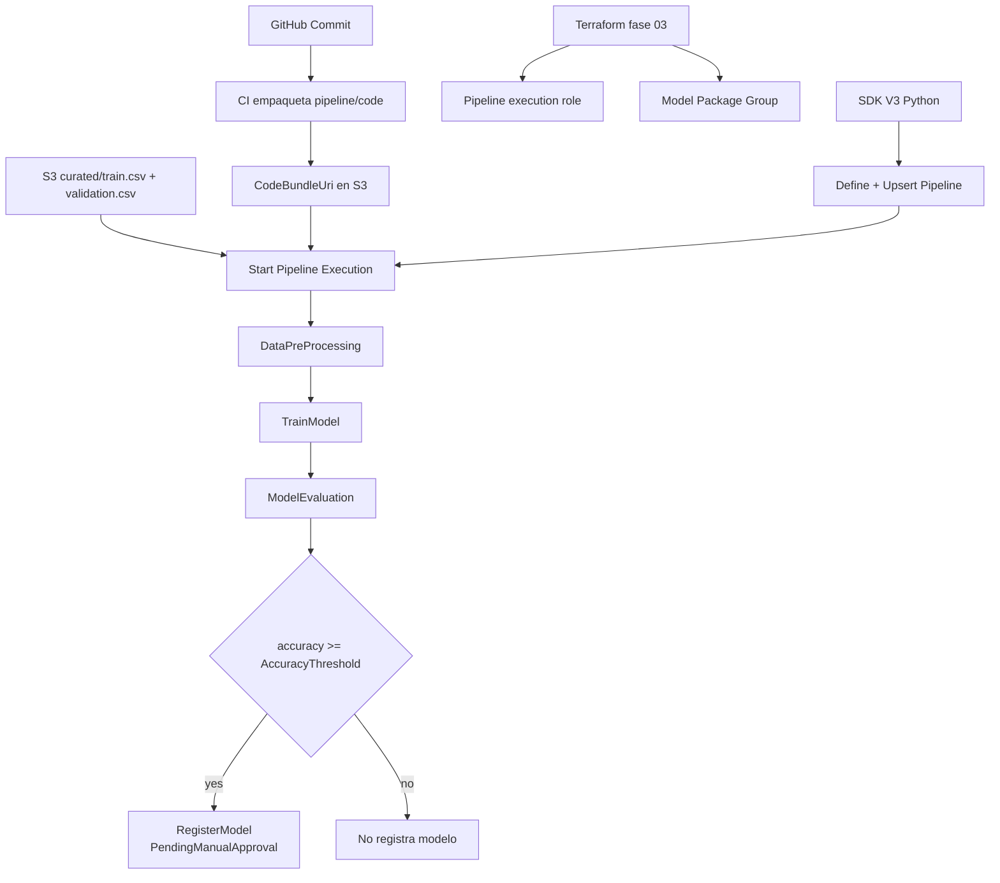

# 03 SageMaker Pipeline

## Objetivo y contexto
Construir el flujo MLOps canonico de `ModelBuild` en SageMaker Pipelines usando el SDK V3:
`DataPreProcessing -> TrainModel -> ModelEvaluation -> QualityGate -> RegisterModel`.

Esta fase usa un enfoque SDK-driven: la definicion del pipeline se construye en Python
con clases V3 y se publica via `pipeline.upsert()`. Terraform gestiona infraestructura
estable (IAM, Model Package Group). La ejecucion del pipeline crea recursos runtime
(processing/training/evaluation jobs, artefactos y versiones de model package).

## Resultado minimo esperado
1. Infraestructura Terraform de fase 03 creada (IAM role, Model Package Group).
2. Pipeline de SageMaker definido y publicado via SDK V3.
3. Ejecucion de pipeline con pasos completados en orden.
4. Registro de modelo en Model Registry cuando cumple el umbral (`accuracy >= 0.78`) con `PendingManualApproval`.

## Fuentes oficiales usadas en esta fase
1. SageMaker V3 MLOps/Pipelines: `vendor/sagemaker-python-sdk/docs/ml_ops/index.rst`
2. Pipeline API: `vendor/sagemaker-python-sdk/docs/api/sagemaker_mlops.rst`
3. Core workflow primitives: `vendor/sagemaker-python-sdk/sagemaker-core/src/sagemaker/core/workflow/`
4. V3 pipeline example: `vendor/sagemaker-python-sdk/v3-examples/ml-ops-examples/v3-pipeline-train-create-registry.ipynb`
5. ModelTrainer: `vendor/sagemaker-python-sdk/docs/training/index.rst`
6. ScriptProcessor: `vendor/sagemaker-python-sdk/sagemaker-core/src/sagemaker/core/processing.py`
7. ModelBuilder: `vendor/sagemaker-python-sdk/docs/inference/index.rst`
8. `https://docs.aws.amazon.com/sagemaker/latest/dg/model-registry.html`

## Estandar SDK en esta fase

Todo el pipeline se define y opera con SageMaker SDK V3:
- `sagemaker.mlops.workflow` para `Pipeline`, `ProcessingStep`, `TrainingStep`, `ConditionStep`, `ModelStep`.
- `sagemaker.core.workflow` para parametros, condiciones, funciones JSON y contexto de pipeline.
- `sagemaker.train.ModelTrainer` para el step de entrenamiento.
- `sagemaker.serve.ModelBuilder` para el registro en Model Registry.

## Prerequisitos concretos
1. Fase 00 completada (SDK V3 instalado, Terraform foundations aplicado).
2. Fase 01 completada (datos en S3: `curated/train.csv`, `curated/validation.csv`).
3. Fase 02 completada (baseline de training validado, umbral de calidad definido).
4. Perfil AWS CLI: `data-science-user`.
5. Deben existir en el repo:
   - `pipeline/code/preprocess.py`
   - `pipeline/code/evaluate.py`
6. Ejecutar desde la raiz del repositorio.

## Contrato de pipeline (parametros, entradas, gate de calidad)

### Parametros obligatorios
| Parametro | Tipo | Default recomendado | Proposito |
|---|---|---|---|
| `CodeBundleUri` | String | `s3://<bucket>/pipeline/code/<git_sha>/pipeline_code.tar.gz` | Bundle de codigo versionado |
| `InputTrainUri` | String | `s3://<bucket>/curated/train.csv` | Entrada de train |
| `InputValidationUri` | String | `s3://<bucket>/curated/validation.csv` | Entrada de validation |
| `AccuracyThreshold` | Float | `0.78` | Umbral de gate para registro |

### Gate de calidad
1. `ModelEvaluation` emite `evaluation.json` con ruta JSON `metrics.accuracy`.
2. `ConditionStep` compara `metrics.accuracy` contra `AccuracyThreshold`.
3. Si cumple, se ejecuta `RegisterModel` con `PendingManualApproval`.

### Split Terraform vs SDK vs runtime
| Capa | Gestionado por | Recursos |
|---|---|---|
| Infraestructura estable | Terraform | IAM role, policies, Model Package Group |
| Definicion de pipeline | SDK V3 Python | Pipeline definition, steps, parameters |
| Recursos runtime | SageMaker (ejecucion) | Processing/training/evaluation jobs, artefactos S3, model package versions |

## Arquitectura end-to-end (Mermaid)

```mermaid
flowchart TD
  GH[GitHub Commit] --> CI[CI empaqueta pipeline/code]
  CI --> S3C[CodeBundleUri en S3]
  TF[Terraform fase 03] --> IAM[Pipeline execution role]
  TF --> MPG[Model Package Group]
  SDK[SDK V3 Python] --> PDef[Define + Upsert Pipeline]
  S3D[S3 curated/train.csv + validation.csv] --> PExec
  S3C --> PExec[Start Pipeline Execution]
  PDef --> PExec
  PExec --> S1[DataPreProcessing]
  S1 --> S2[TrainModel]
  S2 --> S3e[ModelEvaluation]
  S3e --> G{accuracy >= AccuracyThreshold}
  G -- yes --> S4[RegisterModel\nPendingManualApproval]
  G -- no --> F[No registra modelo]
```

## Terraform de fase 03

Terraform crea la infraestructura estable. La definicion del pipeline se gestiona via SDK.

### Recursos Terraform
| Recurso | Archivo | Proposito |
|---|---|---|
| `aws_iam_role.pipeline_execution` | `iam.tf` | Role de ejecucion para Processing/Training/Pipeline |
| `aws_iam_role_policy.pipeline_permissions` | `iam.tf` | Least-privilege para S3, SageMaker, ECR, CloudWatch, PassRole |
| `aws_sagemaker_model_package_group.this` | `model_registry.tf` | Grupo de registro para versiones de modelo |

### Aplicar Terraform

```bash
terraform -chdir=terraform/03_sagemaker_pipeline init
terraform -chdir=terraform/03_sagemaker_pipeline fmt -check
terraform -chdir=terraform/03_sagemaker_pipeline validate
terraform -chdir=terraform/03_sagemaker_pipeline plan \
  -var='data_bucket_name=<from-foundations>'
terraform -chdir=terraform/03_sagemaker_pipeline apply \
  -var='data_bucket_name=<from-foundations>'
```

### Outputs para el SDK
```bash
terraform -chdir=terraform/03_sagemaker_pipeline output -json
```

Outputs clave:
| Output | Uso |
|---|---|
| `pipeline_execution_role_arn` | `SAGEMAKER_PIPELINE_ROLE_ARN` para el SDK |
| `model_package_group_name` | Nombre del grupo de registro |

## Workshop paso a paso (celdas ejecutables)

### Celda 00 -- Imports V3

```python
import os
import time
import json
import uuid
from importlib.metadata import version, PackageNotFoundError

import boto3

# --- Core (session, image URIs, workflow primitives) ---
from sagemaker.core.helper.session_helper import Session
from sagemaker.core import image_uris
from sagemaker.core.workflow.pipeline_context import PipelineSession
from sagemaker.core.workflow.parameters import ParameterString, ParameterFloat
from sagemaker.core.workflow.conditions import ConditionGreaterThanOrEqualTo
from sagemaker.core.workflow.functions import JsonGet
from sagemaker.core.workflow.properties import PropertyFile

# --- Processing (from core) ---
from sagemaker.core.processing import ScriptProcessor
from sagemaker.core.shapes import (
    ProcessingInput,
    ProcessingS3Input,
    ProcessingOutput,
    ProcessingS3Output,
)

# --- Training (V3 ModelTrainer) ---
from sagemaker.train import ModelTrainer
from sagemaker.train.configs import InputData, Compute

# --- Serving (V3 ModelBuilder for registration) ---
from sagemaker.serve.model_builder import ModelBuilder

# --- MLOps (Pipeline, Steps) ---
from sagemaker.mlops.workflow.pipeline import Pipeline
from sagemaker.mlops.workflow.steps import ProcessingStep, TrainingStep, CacheConfig
from sagemaker.mlops.workflow import ConditionStep
from sagemaker.mlops.workflow.model_step import ModelStep

# --- Version check ---
try:
    sm_version = version("sagemaker")
except PackageNotFoundError:
    sm_version = version("sagemaker-core")

assert sm_version.split(".")[0] == "3", f"Se requiere V3, encontrado {sm_version}"
print(f"sagemaker={sm_version}")
```

### Celda 01 -- Bootstrap de profile/region/session

```python
AWS_PROFILE = os.getenv("AWS_PROFILE", "data-science-user")
AWS_REGION = os.getenv("AWS_REGION", "eu-west-1")

boto_session = boto3.session.Session(profile_name=AWS_PROFILE, region_name=AWS_REGION)
sm_client = boto_session.client("sagemaker")
s3_client = boto_session.client("s3")

# Session normal para operaciones directas
session = Session(boto_session=boto_session)

# PipelineSession para definir steps (no ejecuta, solo captura la definicion)
pipeline_session = PipelineSession(boto_session=boto_session, sagemaker_client=sm_client)

# Role de ejecucion de SageMaker Pipeline (de Terraform output)
PIPELINE_EXEC_ROLE_ARN = os.environ["SAGEMAKER_PIPELINE_ROLE_ARN"]

print(f"Profile: {AWS_PROFILE}")
print(f"Region: {AWS_REGION}")
print(f"Role: {PIPELINE_EXEC_ROLE_ARN}")
```

### Celda 02 -- Variables base y URIs

```python
DATA_BUCKET = os.environ["DATA_BUCKET"]
GIT_SHA = os.getenv("GIT_SHA", "manual-" + uuid.uuid4().hex[:8])

PIPELINE_NAME = os.getenv("PIPELINE_NAME", "titanic-modelbuild-dev")
MODEL_PACKAGE_GROUP_NAME = os.getenv("MODEL_PACKAGE_GROUP_NAME", "titanic-survival-xgboost")

CODE_BUNDLE_URI_DEFAULT = f"s3://{DATA_BUCKET}/pipeline/code/{GIT_SHA}/pipeline_code.tar.gz"
INPUT_TRAIN_URI_DEFAULT = f"s3://{DATA_BUCKET}/curated/train.csv"
INPUT_VALIDATION_URI_DEFAULT = f"s3://{DATA_BUCKET}/curated/validation.csv"
RUNTIME_PREFIX = f"s3://{DATA_BUCKET}/pipeline/runtime/{PIPELINE_NAME}"

print(f"Pipeline: {PIPELINE_NAME}")
print(f"Data bucket: {DATA_BUCKET}")
print(f"Code bundle: {CODE_BUNDLE_URI_DEFAULT}")
```

### Celda 03 -- Declaracion de parametros del pipeline

```python
param_code_bundle_uri = ParameterString(
    name="CodeBundleUri", default_value=CODE_BUNDLE_URI_DEFAULT,
)
param_input_train_uri = ParameterString(
    name="InputTrainUri", default_value=INPUT_TRAIN_URI_DEFAULT,
)
param_input_validation_uri = ParameterString(
    name="InputValidationUri", default_value=INPUT_VALIDATION_URI_DEFAULT,
)
param_accuracy_threshold = ParameterFloat(
    name="AccuracyThreshold", default_value=0.78,
)
```

### Celda 04 -- ProcessingStep para DataPreProcessing

```python
cache_config = CacheConfig(enable_caching=True, expire_after="30d")

sklearn_image_uri = image_uris.retrieve(
    framework="sklearn",
    region=AWS_REGION,
    version="1.2-1",
    py_version="py3",
    instance_type="ml.m5.large",
)

preprocess_processor = ScriptProcessor(
    role=PIPELINE_EXEC_ROLE_ARN,
    image_uri=sklearn_image_uri,
    command=["python3"],
    instance_count=1,
    instance_type="ml.m5.large",
    sagemaker_session=pipeline_session,
)

preprocess_step_args = preprocess_processor.run(
    code="pipeline/code/preprocess.py",
    arguments=[
        "--input-train-uri", param_input_train_uri,
        "--input-validation-uri", param_input_validation_uri,
        "--output-prefix", f"{RUNTIME_PREFIX}/preprocess",
        "--code-bundle-uri", param_code_bundle_uri,
    ],
    outputs=[
        ProcessingOutput(
            output_name="train",
            s3_output=ProcessingS3Output(
                s3_uri=f"{RUNTIME_PREFIX}/preprocess/train",
                local_path="/opt/ml/processing/output/train",
                s3_upload_mode="EndOfJob",
            ),
        ),
        ProcessingOutput(
            output_name="validation",
            s3_output=ProcessingS3Output(
                s3_uri=f"{RUNTIME_PREFIX}/preprocess/validation",
                local_path="/opt/ml/processing/output/validation",
                s3_upload_mode="EndOfJob",
            ),
        ),
    ],
)

step_preprocess = ProcessingStep(
    name="DataPreProcessing",
    step_args=preprocess_step_args,
    cache_config=cache_config,
)
```

### Celda 05 -- TrainingStep con ModelTrainer (V3)

```python
xgb_image_uri = image_uris.retrieve(
    framework="xgboost",
    region=AWS_REGION,
    version="1.7-1",
    py_version="py3",
    instance_type="ml.m5.large",
)

model_trainer = ModelTrainer(
    training_image=xgb_image_uri,
    role=PIPELINE_EXEC_ROLE_ARN,
    sagemaker_session=pipeline_session,
    compute=Compute(
        instance_type="ml.m5.large",
        instance_count=1,
    ),
    hyperparameters={
        "objective": "binary:logistic",
        "num_round": 200,
        "max_depth": 5,
        "eta": 0.2,
        "subsample": 0.8,
        "eval_metric": "logloss",
    },
    input_data_config=[
        InputData(
            channel_name="train",
            data_source=step_preprocess.properties.ProcessingOutputConfig.Outputs[
                "train"
            ].S3Output.S3Uri,
            content_type="text/csv",
        ),
        InputData(
            channel_name="validation",
            data_source=step_preprocess.properties.ProcessingOutputConfig.Outputs[
                "validation"
            ].S3Output.S3Uri,
            content_type="text/csv",
        ),
    ],
)

train_step_args = model_trainer.train()

step_train = TrainingStep(
    name="TrainModel",
    step_args=train_step_args,
    cache_config=cache_config,
)
```

### Celda 06 -- ProcessingStep de evaluacion + extraccion de accuracy

```python
evaluation_image_uri = image_uris.retrieve(
    framework="xgboost",
    region=AWS_REGION,
    version="1.7-1",
    py_version="py3",
    instance_type="ml.m5.large",
)

evaluate_processor = ScriptProcessor(
    role=PIPELINE_EXEC_ROLE_ARN,
    image_uri=evaluation_image_uri,
    command=["python3"],
    instance_count=1,
    instance_type="ml.m5.large",
    sagemaker_session=pipeline_session,
)

evaluation_report = PropertyFile(
    name="EvaluationReport",
    output_name="evaluation",
    path="evaluation.json",
)

evaluate_step_args = evaluate_processor.run(
    code="pipeline/code/evaluate.py",
    arguments=[
        "--accuracy-threshold", param_accuracy_threshold,
    ],
    inputs=[
        ProcessingInput(
            input_name="model",
            s3_input=ProcessingS3Input(
                s3_uri=step_train.properties.ModelArtifacts.S3ModelArtifacts,
                local_path="/opt/ml/processing/model",
                s3_data_type="S3Prefix",
                s3_input_mode="File",
            ),
        ),
        ProcessingInput(
            input_name="validation",
            s3_input=ProcessingS3Input(
                s3_uri=step_preprocess.properties.ProcessingOutputConfig.Outputs[
                    "validation"
                ].S3Output.S3Uri,
                local_path="/opt/ml/processing/validation",
                s3_data_type="S3Prefix",
                s3_input_mode="File",
            ),
        ),
    ],
    outputs=[
        ProcessingOutput(
            output_name="evaluation",
            s3_output=ProcessingS3Output(
                s3_uri=f"{RUNTIME_PREFIX}/evaluation",
                local_path="/opt/ml/processing/evaluation",
                s3_upload_mode="EndOfJob",
            ),
        ),
    ],
)

step_evaluate = ProcessingStep(
    name="ModelEvaluation",
    step_args=evaluate_step_args,
    property_files=[evaluation_report],
    cache_config=cache_config,
)
```

### Celda 07 -- ConditionStep + ModelStep (register via ModelBuilder)

```python
# --- Construir ModelBuilder para registro en pipeline ---
model_builder = ModelBuilder(
    s3_model_data_url=step_train.properties.ModelArtifacts.S3ModelArtifacts,
    image_uri=xgb_image_uri,
    sagemaker_session=pipeline_session,
    role_arn=PIPELINE_EXEC_ROLE_ARN,
)

step_register = ModelStep(
    name="RegisterModel",
    step_args=model_builder.register(
        model_package_group_name=MODEL_PACKAGE_GROUP_NAME,
        content_types=["text/csv"],
        response_types=["text/csv"],
        inference_instances=["ml.m5.large"],
        approval_status="PendingManualApproval",
    ),
)

# --- Condicion de calidad ---
accuracy_condition = ConditionGreaterThanOrEqualTo(
    left=JsonGet(
        step_name=step_evaluate.name,
        property_file=evaluation_report,
        json_path="metrics.accuracy",
    ),
    right=param_accuracy_threshold,
)

step_quality_gate = ConditionStep(
    name="QualityGateAccuracy",
    conditions=[accuracy_condition],
    if_steps=[step_register],
    else_steps=[],
)
```

### Celda 08 -- Crear/actualizar pipeline

```python
pipeline = Pipeline(
    name=PIPELINE_NAME,
    parameters=[
        param_code_bundle_uri,
        param_input_train_uri,
        param_input_validation_uri,
        param_accuracy_threshold,
    ],
    steps=[step_preprocess, step_train, step_evaluate, step_quality_gate],
    sagemaker_session=pipeline_session,
)

# Publicar (upsert: crea o actualiza)
upsert_response = pipeline.upsert(role_arn=PIPELINE_EXEC_ROLE_ARN)
print(json.dumps(upsert_response, indent=2, default=str))
```

### Celda 09 -- Iniciar ejecucion

```python
execution = pipeline.start(
    parameters={
        "CodeBundleUri": CODE_BUNDLE_URI_DEFAULT,
        "InputTrainUri": INPUT_TRAIN_URI_DEFAULT,
        "InputValidationUri": INPUT_VALIDATION_URI_DEFAULT,
        "AccuracyThreshold": 0.78,
    }
)

PIPELINE_EXECUTION_ARN = execution.arn
print(f"PipelineExecutionArn: {PIPELINE_EXECUTION_ARN}")
```

### Celda 10 -- Monitoreo de ejecucion y steps

```python
terminal_statuses = {"Succeeded", "Failed", "Stopped"}

while True:
    desc = sm_client.describe_pipeline_execution(
        PipelineExecutionArn=PIPELINE_EXECUTION_ARN,
    )
    status = desc["PipelineExecutionStatus"]
    print(f"Pipeline status: {status}")

    steps_resp = sm_client.list_pipeline_execution_steps(
        PipelineExecutionArn=PIPELINE_EXECUTION_ARN,
        SortOrder="Ascending",
    )
    for item in steps_resp.get("PipelineExecutionSteps", []):
        print(f"  {item.get('StepName')} -> {item.get('StepStatus')}")

    if status in terminal_statuses:
        break
    time.sleep(30)

assert status == "Succeeded", f"Pipeline finalizo en {status}"
```

### Celda 11 -- Verificacion final en Model Registry

```python
# boto3 para inspeccion detallada de packages registrados.
packages = sm_client.list_model_packages(
    ModelPackageGroupName=MODEL_PACKAGE_GROUP_NAME,
    SortBy="CreationTime",
    SortOrder="Descending",
    MaxResults=5,
)["ModelPackageSummaryList"]

assert len(packages) > 0, "No hay ModelPackage en el grupo"
latest_model_package_arn = packages[0]["ModelPackageArn"]

mp_desc = sm_client.describe_model_package(ModelPackageName=latest_model_package_arn)
print(f"ModelPackageArn: {latest_model_package_arn}")
print(f"ModelApprovalStatus: {mp_desc.get('ModelApprovalStatus')}")
```

## Comandos CLI de verificacion operativa

```bash
export AWS_PROFILE=data-science-user
export AWS_REGION=eu-west-1

# Pipeline
aws sagemaker describe-pipeline \
  --pipeline-name titanic-modelbuild-dev \
  --profile "$AWS_PROFILE" --region "$AWS_REGION"

# Ejecuciones
aws sagemaker list-pipeline-executions \
  --pipeline-name titanic-modelbuild-dev \
  --profile "$AWS_PROFILE" --region "$AWS_REGION"

# Steps de una ejecucion
aws sagemaker list-pipeline-execution-steps \
  --pipeline-execution-arn <pipeline_execution_arn> \
  --profile "$AWS_PROFILE" --region "$AWS_REGION"

# Parametros de una ejecucion
aws sagemaker list-pipeline-parameters-for-execution \
  --pipeline-execution-arn <pipeline_execution_arn> \
  --profile "$AWS_PROFILE" --region "$AWS_REGION"

# Model Registry
aws sagemaker list-model-packages \
  --model-package-group-name titanic-survival-xgboost \
  --sort-by CreationTime --sort-order Descending \
  --profile "$AWS_PROFILE" --region "$AWS_REGION"
```

## Operacion avanzada (cache + retry + monitoreo)

### 1) Regla de Step Caching
- Habilitar cache en `DataPreProcessing`, `TrainModel`, `ModelEvaluation` cuando
  no cambio el codigo ni la entrada de datos.
- Deshabilitar cache cuando cambias scripts de `pipeline/code/*`, cambias parametros
  que alteran feature engineering/entrenamiento, o necesitas recomputo para auditoria.

### 2) Retry con `RetryPipelineExecution`
Para errores transitorios (throttling, timeout puntual):

```bash
aws sagemaker retry-pipeline-execution \
  --pipeline-execution-arn <failed_pipeline_execution_arn> \
  --pipeline-execution-description "Retry after transient failure" \
  --profile data-science-user --region eu-west-1
```

Para fallos deterministicos (script, IAM, imagen, path): aplicar fix y lanzar nueva
ejecucion con `pipeline.start()`.

### 3) Triage por estado de step
| StepStatus | Lectura operativa | Accion recomendada |
|---|---|---|
| `Executing` | Step en curso | Revisar logs de CloudWatch y esperar |
| `Succeeded` | Step completado | Continuar al siguiente |
| `Failed` | Fallo de ejecucion | Inspeccionar `FailureReason`, fix o retry |
| `Stopped` | Detenido manualmente | Confirmar motivo y relanzar |

### 4) Limpieza de prefijos preprocess
Si cambia el formato de salida y hay riesgo de archivos legacy:

```bash
aws s3 rm s3://$DATA_BUCKET/pipeline/runtime/$PIPELINE_NAME/preprocess/train/ \
  --recursive --profile data-science-user --region eu-west-1
aws s3 rm s3://$DATA_BUCKET/pipeline/runtime/$PIPELINE_NAME/preprocess/validation/ \
  --recursive --profile data-science-user --region eu-west-1
```

## Troubleshooting
| Sintoma | Causa raiz probable | Accion recomendada |
|---|---|---|
| `NoSuchKey` al iniciar por `CodeBundleUri` | URI incorrecta o artefacto no subido | Validar `s3://$DATA_BUCKET/pipeline/code/$GIT_SHA/pipeline_code.tar.gz` |
| `AccessDenied` en S3/IAM | Policy incompleta en role de pipeline | Revisar `s3:GetObject`, `s3:ListBucket`, `s3:PutObject`, `sagemaker:CreateModelPackageGroup` |
| `ConditionStep` no encuentra `metrics.accuracy` | `evaluation.json` con path distinto | Ajustar output de `evaluate.py` para `metrics.accuracy` |
| `TrainModel` falla con `Delimiter ',' is not found` | Archivos heredados en preprocess | Limpiar prefijos preprocess y relanzar |
| `ModelEvaluation` falla con `ModuleNotFoundError: No module named 'xgboost'` | Imagen sin dependencia | Usar imagen XGBoost como `evaluation_image_uri` |
| `ImportError: cannot import name 'Pipeline' from 'sagemaker.workflow'` | Imports fuera del namespace V3 o instalacion inconsistente | Usar imports V3 de este tutorial e instalar `sagemaker>=3.5.0` |
| `ImportError: cannot import name 'ModelTrainer'` | Paquete SageMaker incorrecto o instalacion incompleta | Verificar instalacion y version `sagemaker>=3.5.0` |

## Evidencia requerida
1. `terraform plan` de fase 03 revisado.
2. `CodeBundleUri` usado (con commit SHA) y evidencia de objeto en S3.
3. `PipelineArn` y `PipelineExecutionArn`.
4. Estado por step (`DataPreProcessing`, `TrainModel`, `ModelEvaluation`, `QualityGateAccuracy`, `RegisterModel`).
5. `ModelPackageArn` registrado y `ModelApprovalStatus=PendingManualApproval`.
6. Referencia a logs de CloudWatch.

## Criterio de cierre
1. Pipeline definido con SDK V3 y publicado via `pipeline.upsert()`.
2. Contrato de parametros aplicado (`CodeBundleUri`, `InputTrainUri`, `InputValidationUri`, `AccuracyThreshold`).
3. Pipeline ejecuta end-to-end desde `curated/*`.
4. Gate de calidad se evalua sobre `metrics.accuracy`.
5. `RegisterModel` se ejecuta solo si cumple umbral.
6. Evidencia registrada en `docs/iterations/`.

## Riesgos/pendientes
1. Si faltan scripts en `pipeline/code/`, la ejecucion no es reproducible.
2. Si el JSON de evaluacion cambia de forma, el gate puede romperse.
3. Drift entre codigo y ejecucion si no se usa `CodeBundleUri` inmutable por SHA.
4. Falta de trigger programado hasta fase de orquestacion.
5. La transicion de `pipeline_definition.json.tpl` (Terraform-managed) a SDK-driven requiere
   sincronizar la definicion publicada con la version que Terraform conoce.

## Proximo paso
Definir serving con endpoint en `docs/tutorials/04-serving-sagemaker.md` y conectar
promotion gate con CI/CD en fase 05.
