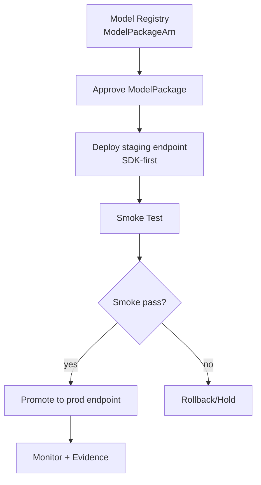

# 04 Serving SageMaker

## Objetivo y contexto
Publicar inferencia de forma controlada usando SageMaker Hosting a partir del `ModelPackage` registrado en fase 03.

Alcance de cierre de esta fase (obligatorio):
1. Aprobar `ModelPackage` en Model Registry.
2. Desplegar endpoint `staging`.
3. Ejecutar smoke tests de inferencia.
4. Promover a endpoint `prod` solo si `staging` pasa.

Nota de alcance:
- ECS/Fargate queda fuera del cierre de fase 04 y se mueve como extension futura.

## Resultado minimo esperado
1. Existe un `ModelPackageArn` aprobado y trazable al pipeline de fase 03.
2. Existe endpoint `staging` en estado `InService`.
3. Smoke test de `staging` documentado con resultado `pass`.
4. Existe endpoint `prod` en estado `InService` despues de gate manual.
5. Existe ruta de rollback y cleanup documentada.

## Fuentes oficiales (SageMaker DG/API) usadas en esta fase
1. `https://docs.aws.amazon.com/sagemaker/latest/APIReference/API_DescribeModelPackage.html`
2. `https://docs.aws.amazon.com/sagemaker/latest/APIReference/API_UpdateModelPackage.html`
3. `https://docs.aws.amazon.com/sagemaker/latest/APIReference/API_CreateModel.html`
4. `https://docs.aws.amazon.com/sagemaker/latest/APIReference/API_CreateEndpointConfig.html`
5. `https://docs.aws.amazon.com/sagemaker/latest/APIReference/API_CreateEndpoint.html`
6. `https://docs.aws.amazon.com/sagemaker/latest/APIReference/API_DescribeEndpoint.html`
7. `https://docs.aws.amazon.com/sagemaker/latest/APIReference/API_InvokeEndpoint.html`
8. `https://docs.aws.amazon.com/sagemaker/latest/APIReference/API_UpdateEndpoint.html`
9. `https://docs.aws.amazon.com/sagemaker/latest/APIReference/API_DeleteEndpoint.html`
10. `https://docs.aws.amazon.com/sagemaker/latest/dg/model-registry-models.html`
11. `https://docs.aws.amazon.com/sagemaker/latest/dg/realtime-endpoints.html`
12. `https://docs.aws.amazon.com/sagemaker/latest/dg/realtime-endpoints-deployment-guardrails.html`
13. `https://sagemaker.readthedocs.io/en/stable/api/inference/model.html#sagemaker.model.ModelPackage`

## Regla de implementacion de notebook (SDK-first)
1. Priorizar `sagemaker` (version mayor 3) para session/contexto y deploy base (`ModelPackage.deploy`).
2. Usar `boto3` solo como fallback operativo cuando sea necesario (`UpdateEndpoint`, detalles de runtime o verificacion fina).
3. Operar con identidad base `data-science-user` y region `eu-west-1`.
4. Documentar en cada bloque fallback el motivo operacional.

## Contrato de serving (inputs/gates)
| Parametro | Tipo | Default recomendado | Proposito |
|---|---|---|---|
| `ModelPackageArn` | String | `arn:aws:sagemaker:...:model-package/<group>/<version>` | Modelo versionado a promover |
| `StagingEndpointName` | String | `titanic-survival-staging` | Endpoint de validacion previa |
| `ProdEndpointName` | String | `titanic-survival-prod` | Endpoint productivo |
| `InstanceType` | String | `ml.m5.large` | Tipo de instancia hosting |
| `InitialInstanceCount` | Integer | `1` | Capacidad inicial del endpoint |

Regla de gate:
1. Solo promover a `prod` si `staging` esta `InService` y smoke test es `pass`.
2. No hacer bypass del registry: el deploy debe consumir `ModelPackageArn`.

### IAM minimo para serving (sin adivinanzas)
Acciones minimas requeridas por el rol de ejecucion (`SAGEMAKER_PIPELINE_ROLE_ARN`) y operador:
1. `sagemaker:DescribeModelPackage`, `sagemaker:UpdateModelPackage`.
2. `sagemaker:CreateModel`, `sagemaker:CreateEndpointConfig`, `sagemaker:CreateEndpoint`, `sagemaker:UpdateEndpoint`, `sagemaker:DescribeEndpoint`, `sagemaker:InvokeEndpoint`, `sagemaker:DeleteEndpoint`.
3. `iam:PassRole` limitado al rol de ejecucion de SageMaker (sin wildcard global).
4. Acceso a artefactos S3 del modelo registrado (`s3:GetObject` sobre prefijos de artefactos).

## Arquitectura end-to-end (Mermaid)


## Workshop paso a paso (celdas/CLI ejecutables)
### Celda 00 - bootstrap de sesion
```python
import json
import os
import time
from datetime import datetime
from importlib.metadata import PackageNotFoundError, version

import boto3
import sagemaker
from botocore.exceptions import ClientError
from sagemaker.deserializers import CSVDeserializer
from sagemaker.model import ModelPackage
from sagemaker.predictor import Predictor
from sagemaker.serializers import CSVSerializer
from sagemaker.session import Session

try:
    sm_version = version("sagemaker")
except PackageNotFoundError:
    sm_version = version("sagemaker-core")

assert sm_version.split(".")[0] == "3", sm_version

AWS_PROFILE = os.getenv("AWS_PROFILE", "data-science-user")
AWS_REGION = os.getenv("AWS_REGION", "eu-west-1")

boto_sess = boto3.session.Session(profile_name=AWS_PROFILE, region_name=AWS_REGION)
sm_client = boto_sess.client("sagemaker")
sm_runtime_client = boto_sess.client("sagemaker-runtime")
sm_session = Session(
    boto_session=boto_sess,
    sagemaker_client=sm_client,
    sagemaker_runtime_client=sm_runtime_client,
)

print("profile:", AWS_PROFILE)
print("region:", AWS_REGION)
print("sdk:", sm_version)
```

### Celda 01 - parametros de serving
```python
MODEL_PACKAGE_ARN = os.environ["MODEL_PACKAGE_ARN"]
STAGING_ENDPOINT_NAME = os.getenv("STAGING_ENDPOINT_NAME", "titanic-survival-staging")
PROD_ENDPOINT_NAME = os.getenv("PROD_ENDPOINT_NAME", "titanic-survival-prod")
INSTANCE_TYPE = os.getenv("INSTANCE_TYPE", "ml.m5.large")
INITIAL_INSTANCE_COUNT = int(os.getenv("INITIAL_INSTANCE_COUNT", "1"))
SAGEMAKER_EXEC_ROLE_ARN = os.environ["SAGEMAKER_PIPELINE_ROLE_ARN"]

stamp = datetime.utcnow().strftime("%Y%m%d-%H%M%S")
```

### Celda 02 - validar y aprobar ModelPackage
```python
mp = sm_client.describe_model_package(ModelPackageName=MODEL_PACKAGE_ARN)
print("ModelPackageStatus:", mp["ModelPackageStatus"])
print("ModelApprovalStatus:", mp["ModelApprovalStatus"])

if mp["ModelApprovalStatus"] != "Approved":
    sm_client.update_model_package(
        ModelPackageArn=MODEL_PACKAGE_ARN,
        ModelApprovalStatus="Approved",
    )
    print("ModelPackage aprobado")
```

### Celda 03 - utilidades SDK-first + fallback operativo
```python
def wait_endpoint(endpoint_name: str, timeout_sec: int = 1800):
    start = time.time()
    while True:
        desc = sm_client.describe_endpoint(EndpointName=endpoint_name)
        status = desc["EndpointStatus"]
        print(endpoint_name, status)
        if status == "InService":
            return desc
        if status in {"Failed", "OutOfService"}:
            raise RuntimeError(
                f"Endpoint {endpoint_name} en estado {status}: {desc.get('FailureReason')}"
            )
        if time.time() - start > timeout_sec:
            raise TimeoutError(f"Timeout esperando endpoint {endpoint_name}")
        time.sleep(30)


def endpoint_exists(endpoint_name: str) -> bool:
    try:
        sm_client.describe_endpoint(EndpointName=endpoint_name)
        return True
    except ClientError as exc:
        code = exc.response.get("Error", {}).get("Code", "")
        if code in {"ValidationException", "ResourceNotFound", "ResourceNotFoundException"}:
            return False
        raise


def deploy_new_endpoint_sdk(endpoint_name: str, model_package_arn: str):
    model = ModelPackage(
        role=SAGEMAKER_EXEC_ROLE_ARN,
        model_package_arn=model_package_arn,
        sagemaker_session=sm_session,
        predictor_cls=Predictor,
    )
    predictor = model.deploy(
        endpoint_name=endpoint_name,
        instance_type=INSTANCE_TYPE,
        initial_instance_count=INITIAL_INSTANCE_COUNT,
        wait=True,
    )
    predictor.serializer = CSVSerializer()
    predictor.deserializer = CSVDeserializer()
    return predictor, {"path": "sdk", "endpoint": endpoint_name}


def update_existing_endpoint_boto_fallback(endpoint_name: str, model_package_arn: str):
    model_name = f"{endpoint_name}-model-{stamp}".lower()
    endpoint_config_name = f"{endpoint_name}-cfg-{stamp}".lower()

    sm_client.create_model(
        ModelName=model_name,
        ExecutionRoleArn=SAGEMAKER_EXEC_ROLE_ARN,
        PrimaryContainer={"ModelPackageName": model_package_arn},
    )

    sm_client.create_endpoint_config(
        EndpointConfigName=endpoint_config_name,
        ProductionVariants=[
            {
                "VariantName": "AllTraffic",
                "ModelName": model_name,
                "InitialInstanceCount": INITIAL_INSTANCE_COUNT,
                "InstanceType": INSTANCE_TYPE,
                "InitialVariantWeight": 1.0,
            }
        ],
    )

    sm_client.update_endpoint(
        EndpointName=endpoint_name,
        EndpointConfigName=endpoint_config_name,
    )
    wait_endpoint(endpoint_name)

    predictor = Predictor(
        endpoint_name=endpoint_name,
        sagemaker_session=sm_session,
        serializer=CSVSerializer(),
        deserializer=CSVDeserializer(),
    )
    return predictor, {
        "path": "boto3-fallback-update",
        "endpoint": endpoint_name,
        "model_name": model_name,
        "endpoint_config_name": endpoint_config_name,
    }


def upsert_endpoint(endpoint_name: str, model_package_arn: str):
    if endpoint_exists(endpoint_name):
        return update_existing_endpoint_boto_fallback(endpoint_name, model_package_arn)
    return deploy_new_endpoint_sdk(endpoint_name, model_package_arn)
```

### Celda 04 - desplegar staging
```python
staging_predictor, staging_assets = upsert_endpoint(STAGING_ENDPOINT_NAME, MODEL_PACKAGE_ARN)
print(json.dumps(staging_assets, indent=2))
```

### Celda 05 - smoke test en staging
```python
sample_payload = "3,0,22,1,0,7.25,2\n1,1,38,1,0,71.2833,0\n"

try:
    preds = staging_predictor.predict(sample_payload)
except Exception:
    # fallback operativo puntual cuando predictor no serializa como esperado
    resp = sm_runtime_client.invoke_endpoint(
        EndpointName=STAGING_ENDPOINT_NAME,
        ContentType="text/csv",
        Body=sample_payload.encode("utf-8"),
    )
    preds = resp["Body"].read().decode("utf-8")

print("predictions:", preds)
assert str(preds).strip(), "Smoke test vacio"
SMOKE_PASS = True
```

### Celda 06 - gate de promocion y despliegue prod
```python
assert SMOKE_PASS is True, "Smoke test fallido, no promover"
prod_predictor, prod_assets = upsert_endpoint(PROD_ENDPOINT_NAME, MODEL_PACKAGE_ARN)
print(json.dumps(prod_assets, indent=2))
```

### Celda 07 - verificacion final
```python
for name in [STAGING_ENDPOINT_NAME, PROD_ENDPOINT_NAME]:
    desc = sm_client.describe_endpoint(EndpointName=name)
    print(name, desc["EndpointStatus"], desc["EndpointArn"])
```

### Celda 08 - cleanup opcional para control de costos
```python
def cleanup_endpoint(endpoint_name: str):
    try:
        endpoint_desc = sm_client.describe_endpoint(EndpointName=endpoint_name)
        cfg_name = endpoint_desc["EndpointConfigName"]
        sm_client.delete_endpoint(EndpointName=endpoint_name)
        print("delete_endpoint:", endpoint_name)
        return {"endpoint": endpoint_name, "endpoint_config": cfg_name}
    except ClientError as exc:
        code = exc.response.get("Error", {}).get("Code", "")
        if code in {"ValidationException", "ResourceNotFound", "ResourceNotFoundException"}:
            print("endpoint no existe:", endpoint_name)
            return None
        raise

# Descomentar cuando se quiera apagar entornos no productivos
# cleanup_endpoint(STAGING_ENDPOINT_NAME)
```

## Comandos CLI de verificacion operativa
```bash
export AWS_PROFILE=data-science-user
export AWS_REGION=eu-west-1

aws sagemaker describe-model-package \
  --model-package-name "$MODEL_PACKAGE_ARN" \
  --profile "$AWS_PROFILE" --region "$AWS_REGION"

aws sagemaker update-model-package \
  --model-package-arn "$MODEL_PACKAGE_ARN" \
  --model-approval-status Approved \
  --profile "$AWS_PROFILE" --region "$AWS_REGION"

aws sagemaker describe-endpoint \
  --endpoint-name titanic-survival-staging \
  --profile "$AWS_PROFILE" --region "$AWS_REGION"

aws sagemaker describe-endpoint \
  --endpoint-name titanic-survival-prod \
  --profile "$AWS_PROFILE" --region "$AWS_REGION"

aws sagemaker-runtime invoke-endpoint \
  --endpoint-name titanic-survival-staging \
  --content-type text/csv \
  --body '3,0,22,1,0,7.25,2' \
  /tmp/staging_pred.txt \
  --profile "$AWS_PROFILE" --region "$AWS_REGION"

# cleanup opcional en no-prod
aws sagemaker delete-endpoint \
  --endpoint-name titanic-survival-staging \
  --profile "$AWS_PROFILE" --region "$AWS_REGION"
```

## Operacion avanzada (promocion, rollback, monitoreo)
### 1) Promocion controlada
1. `prod` solo puede usar `ModelPackageArn` en estado `Approved`.
2. Promocion valida requiere evidencia de smoke test en `staging`.

### 2) Rollback minimo
1. Conservar `EndpointConfigName` previo de `prod` antes de actualizar.
2. Si hay regresion, ejecutar `UpdateEndpoint` apuntando al config previo.

### 3) Monitoreo minimo
1. Monitorear estado de endpoint (`InService`, `Updating`, `Failed`).
2. Registrar latencia/error de smoke test y timestamp de despliegue.

### 4) Cleanup y control de costos
1. Eliminar `staging` al terminar validaciones cuando no se use 24/7.
2. Mantener checklist de endpoints activos por ambiente en cada iteracion.

### 5) Extension futura (fuera de alcance de cierre fase 04)
1. Exponer inferencia por capa ECS/Fargate solo despues de cerrar fase 04.
2. ECS se tratara como backlog posterior y no bloquea cierre actual.

## Troubleshooting
| Sintoma | Causa raiz probable | Accion recomendada |
|---|---|---|
| `ValidationException` en `CreateModel` | `ModelPackageArn` invalido o no disponible | validar ARN exacto con `DescribeModelPackage` |
| `ModelPackage` no promociona | estado de aprobacion no actualizado | ejecutar `UpdateModelPackage` a `Approved` |
| endpoint queda en `Failed` | contenedor/model artifact incompatible o IAM insuficiente | revisar `FailureReason` en `DescribeEndpoint` y permisos de role |
| `InvokeEndpoint` devuelve error 4xx/5xx | payload invalido o modelo no listo | validar `ContentType`, formato CSV y estado `InService` |
| regresion funcional en `prod` | modelo nuevo no cumple comportamiento esperado | ejecutar rollback con `UpdateEndpoint` al config previo |

## Evidencia requerida
1. `ModelPackageArn` usado + `ModelApprovalStatus=Approved`.
2. `EndpointArn` y estado `InService` para `staging` y `prod`.
3. Resultado de smoke test de `staging`.
4. Evidencia de gate manual previo a promocion de `prod`.
5. Registro de rollback (config anterior y timestamp) y evidencia de cleanup no-prod.

## Criterio de cierre
1. Fase 04 cierra con SageMaker Hosting, sin dependencia de ECS.
2. `staging` y `prod` existen en `InService`.
3. `prod` se despliega solo despues de smoke test `pass` en `staging`.
4. Existe evidencia de aprobacion y trazabilidad a `ModelPackageArn`.
5. Existe procedimiento de rollback y cleanup operativo documentado.

## Riesgos/pendientes
1. Coste elevado por endpoints activos 24/7 sin scheduler.
2. Drift de configuracion si no se versiona `EndpointConfig` por despliegue.
3. Falta de automatizacion CI/CD de la promocion (fase 05).

## Proximo paso
Reescribir y ejecutar backlog de `docs/tutorials/05-cicd-github-actions.md` para automatizar `ModelBuild` y `ModelDeploy` con gates.
