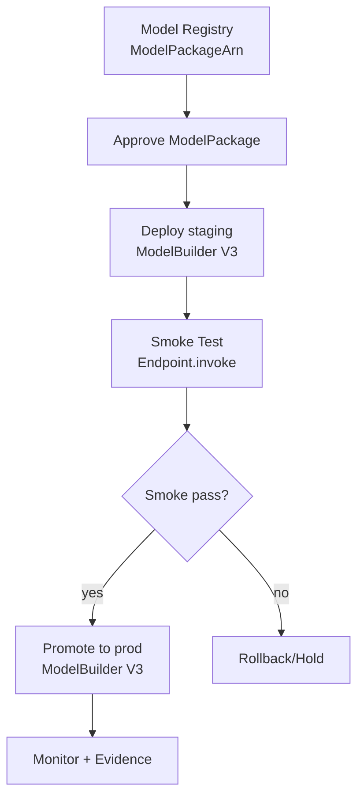

# 04 Serving SageMaker

## Objetivo y contexto
Publicar inferencia de forma controlada usando SageMaker Hosting a partir del `ModelPackage`
registrado en fase 03, usando el SDK V3 `ModelBuilder` para deployment y
`Endpoint.invoke()` para inferencia.

Alcance de cierre:
1. Aprobar `ModelPackage` en Model Registry.
2. Desplegar endpoint `staging`.
3. Ejecutar smoke tests de inferencia.
4. Promover a endpoint `prod` solo si `staging` pasa.

## Resultado minimo esperado
1. `ModelPackageArn` aprobado y trazable al pipeline de fase 03.
2. Endpoint `staging` en estado `InService`.
3. Smoke test de `staging` documentado con resultado `pass`.
4. Endpoint `prod` en estado `InService` despues de gate manual.
5. Ruta de rollback y cleanup documentada.

## Fuentes oficiales usadas en esta fase
1. SageMaker V3 Inference: `vendor/sagemaker-python-sdk/docs/inference/index.rst`
2. ModelBuilder API: `vendor/sagemaker-python-sdk/docs/api/sagemaker_serve.rst`
3. Core resources (Endpoint, Model): `vendor/sagemaker-python-sdk/sagemaker-core/src/sagemaker/core/resources.py`
4. V3 E2E inference example: `vendor/sagemaker-python-sdk/v3-examples/inference-examples/train-inference-e2e-example.ipynb`
5. `https://docs.aws.amazon.com/sagemaker/latest/dg/realtime-endpoints.html`
6. `https://docs.aws.amazon.com/sagemaker/latest/APIReference/API_InvokeEndpoint.html`
7. `https://docs.aws.amazon.com/sagemaker/latest/dg/model-registry-models.html`

## V2 -> V3: que cambio en esta fase

| Concepto | V2 (anterior) | V3 (actual) |
|---|---|---|
| Deploy modelo | `ModelPackage(model_package_arn=...).deploy()` | `ModelBuilder(s3_model_data_url=...).build()` then `.deploy()` |
| Retorno de deploy | `Predictor` object | `Endpoint` object (`sagemaker.core.resources.Endpoint`) |
| Invocar | `predictor.predict(data)` | `endpoint.invoke(body=data, content_type="text/csv")` |
| Serializers | `CSVSerializer()` / `CSVDeserializer()` | No se necesitan; se pasa `content_type` directamente |
| Session | `sagemaker.session.Session()` | `sagemaker.core.helper.session_helper.Session()` |
| Cleanup | `predictor.delete_endpoint()` | `endpoint.delete()` + `EndpointConfig.get(...).delete()` |

Referencia: `vendor/sagemaker-python-sdk/migration.md`

## Prerequisitos concretos
1. Fases 00-03 completadas.
2. Al menos un `ModelPackage` registrado en `titanic-survival-xgboost` con `PendingManualApproval`.
3. Perfil AWS CLI: `data-science-user`.
4. `SAGEMAKER_PIPELINE_ROLE_ARN` disponible (de Terraform output).
5. `MODEL_PACKAGE_ARN` definido (de fase 03, celda 11).
6. Ejecutar desde la raiz del repositorio.

## Contrato de serving
| Parametro | Tipo | Default | Proposito |
|---|---|---|---|
| `ModelPackageArn` | String | Desde fase 03 | Modelo versionado a promover |
| `StagingEndpointName` | String | `titanic-survival-staging` | Endpoint de validacion |
| `ProdEndpointName` | String | `titanic-survival-prod` | Endpoint productivo |
| `InstanceType` | String | `ml.m5.large` | Tipo de instancia hosting |
| `InitialInstanceCount` | Integer | `1` | Capacidad inicial |

Gate:
1. Solo promover a `prod` si `staging` esta `InService` y smoke test es `pass`.
2. El deploy debe consumir `ModelPackageArn` -- no bypass del registry.

## Arquitectura end-to-end (Mermaid)

```mermaid
flowchart TD
  R[Model Registry\nModelPackageArn] --> A[Approve ModelPackage]
  A --> S[Deploy staging\nModelBuilder V3]
  S --> T[Smoke Test\nEndpoint.invoke]
  T --> G{Smoke pass?}
  G -- yes --> P[Promote to prod\nModelBuilder V3]
  G -- no --> RB[Rollback/Hold]
  P --> M[Monitor + Evidence]
```

## IAM minimo para serving
1. `sagemaker:DescribeModelPackage`, `sagemaker:UpdateModelPackage`.
2. `sagemaker:CreateModel`, `sagemaker:CreateEndpointConfig`, `sagemaker:CreateEndpoint`,
   `sagemaker:UpdateEndpoint`, `sagemaker:DescribeEndpoint`, `sagemaker:InvokeEndpoint`,
   `sagemaker:DeleteEndpoint`, `sagemaker:DeleteEndpointConfig`, `sagemaker:DeleteModel`.
3. `iam:PassRole` limitado al rol de ejecucion de SageMaker.
4. `s3:GetObject` sobre prefijos de artefactos del modelo.

## Workshop paso a paso (celdas ejecutables)

### Celda 00 -- Bootstrap de sesion V3

```python
import json
import os
import time
from datetime import datetime, timezone
from importlib.metadata import PackageNotFoundError, version

import boto3
from botocore.exceptions import ClientError

from sagemaker.core.helper.session_helper import Session
from sagemaker.core.resources import Endpoint, EndpointConfig, Model
from sagemaker.serve.model_builder import ModelBuilder

try:
    sm_version = version("sagemaker")
except PackageNotFoundError:
    sm_version = version("sagemaker-core")

assert sm_version.split(".")[0] == "3", f"Se requiere V3, encontrado {sm_version}"

AWS_PROFILE = os.getenv("AWS_PROFILE", "data-science-user")
AWS_REGION = os.getenv("AWS_REGION", "eu-west-1")

boto_sess = boto3.session.Session(profile_name=AWS_PROFILE, region_name=AWS_REGION)
sm_client = boto_sess.client("sagemaker")
sm_runtime_client = boto_sess.client("sagemaker-runtime")
session = Session(boto_session=boto_sess)

print(f"Profile: {AWS_PROFILE}")
print(f"Region: {AWS_REGION}")
print(f"SDK: {sm_version}")
```

### Celda 01 -- Parametros de serving

```python
MODEL_PACKAGE_ARN = os.environ["MODEL_PACKAGE_ARN"]
STAGING_ENDPOINT_NAME = os.getenv("STAGING_ENDPOINT_NAME", "titanic-survival-staging")
PROD_ENDPOINT_NAME = os.getenv("PROD_ENDPOINT_NAME", "titanic-survival-prod")
INSTANCE_TYPE = os.getenv("INSTANCE_TYPE", "ml.m5.large")
INITIAL_INSTANCE_COUNT = int(os.getenv("INITIAL_INSTANCE_COUNT", "1"))
SAGEMAKER_EXEC_ROLE_ARN = os.environ["SAGEMAKER_PIPELINE_ROLE_ARN"]

stamp = datetime.now(timezone.utc).strftime("%Y%m%d-%H%M%S")

print(f"ModelPackageArn: {MODEL_PACKAGE_ARN}")
print(f"Staging: {STAGING_ENDPOINT_NAME}")
print(f"Prod: {PROD_ENDPOINT_NAME}")
```

### Celda 02 -- Validar y aprobar ModelPackage

```python
mp = sm_client.describe_model_package(ModelPackageName=MODEL_PACKAGE_ARN)
print(f"ModelPackageStatus: {mp['ModelPackageStatus']}")
print(f"ModelApprovalStatus: {mp['ModelApprovalStatus']}")

if mp["ModelApprovalStatus"] != "Approved":
    sm_client.update_model_package(
        ModelPackageArn=MODEL_PACKAGE_ARN,
        ModelApprovalStatus="Approved",
    )
    print("ModelPackage aprobado")
```

### Celda 03 -- Funciones de deploy y utilidades

```python
def endpoint_exists(endpoint_name: str) -> bool:
    """Verifica si un endpoint existe."""
    try:
        sm_client.describe_endpoint(EndpointName=endpoint_name)
        return True
    except ClientError as exc:
        code = exc.response.get("Error", {}).get("Code", "")
        if code in {"ValidationException", "ResourceNotFound", "ResourceNotFoundException"}:
            return False
        raise


def wait_endpoint(endpoint_name: str, timeout_sec: int = 1800):
    """Espera a que un endpoint alcance InService o falle."""
    start = time.time()
    while True:
        desc = sm_client.describe_endpoint(EndpointName=endpoint_name)
        status = desc["EndpointStatus"]
        print(f"  {endpoint_name}: {status}")
        if status == "InService":
            return desc
        if status in {"Failed", "OutOfService"}:
            raise RuntimeError(
                f"Endpoint {endpoint_name} en estado {status}: {desc.get('FailureReason')}"
            )
        if time.time() - start > timeout_sec:
            raise TimeoutError(f"Timeout esperando endpoint {endpoint_name}")
        time.sleep(30)


def deploy_new_endpoint(endpoint_name: str, model_package_arn: str):
    """Despliega un nuevo endpoint usando ModelBuilder V3.

    ModelBuilder.build() crea el SageMaker Model resource.
    ModelBuilder.deploy() crea EndpointConfig + Endpoint y devuelve Endpoint.
    """
    # Obtener imagen y model_data del ModelPackage
    mp_desc = sm_client.describe_model_package(ModelPackageName=model_package_arn)
    container = mp_desc["InferenceSpecification"]["Containers"][0]
    image_uri = container["Image"]
    model_data_url = container["ModelDataUrl"]

    model_builder = ModelBuilder(
        s3_model_data_url=model_data_url,
        image_uri=image_uri,
        sagemaker_session=session,
        role_arn=SAGEMAKER_EXEC_ROLE_ARN,
    )

    model_name = f"{endpoint_name}-model-{stamp}".lower()
    core_model = model_builder.build(model_name=model_name)
    print(f"  Model created: {core_model.model_name}")

    core_endpoint = model_builder.deploy(
        endpoint_name=endpoint_name,
        instance_type=INSTANCE_TYPE,
        initial_instance_count=INITIAL_INSTANCE_COUNT,
    )
    print(f"  Endpoint created: {core_endpoint.endpoint_name}")
    return core_endpoint, {"path": "model-builder-v3", "endpoint": endpoint_name, "model": model_name}


def update_existing_endpoint(endpoint_name: str, model_package_arn: str):
    """Actualiza un endpoint existente (boto3 fallback).

    ModelBuilder.deploy() no soporta update de endpoints existentes directamente.
    Se usa boto3 para crear Model + EndpointConfig y luego UpdateEndpoint.
    """
    model_name = f"{endpoint_name}-model-{stamp}".lower()
    endpoint_config_name = f"{endpoint_name}-cfg-{stamp}".lower()

    sm_client.create_model(
        ModelName=model_name,
        ExecutionRoleArn=SAGEMAKER_EXEC_ROLE_ARN,
        PrimaryContainer={"ModelPackageName": model_package_arn},
    )

    sm_client.create_endpoint_config(
        EndpointConfigName=endpoint_config_name,
        ProductionVariants=[
            {
                "VariantName": "AllTraffic",
                "ModelName": model_name,
                "InitialInstanceCount": INITIAL_INSTANCE_COUNT,
                "InstanceType": INSTANCE_TYPE,
                "InitialVariantWeight": 1.0,
            }
        ],
    )

    sm_client.update_endpoint(
        EndpointName=endpoint_name,
        EndpointConfigName=endpoint_config_name,
    )
    wait_endpoint(endpoint_name)

    return None, {
        "path": "boto3-fallback-update",
        "endpoint": endpoint_name,
        "model_name": model_name,
        "endpoint_config_name": endpoint_config_name,
    }


def upsert_endpoint(endpoint_name: str, model_package_arn: str):
    """Crea o actualiza un endpoint segun su existencia."""
    if endpoint_exists(endpoint_name):
        print(f"Endpoint {endpoint_name} existe, actualizando...")
        return update_existing_endpoint(endpoint_name, model_package_arn)
    print(f"Endpoint {endpoint_name} no existe, creando...")
    return deploy_new_endpoint(endpoint_name, model_package_arn)
```

### Celda 04 -- Desplegar staging

```python
staging_endpoint, staging_assets = upsert_endpoint(STAGING_ENDPOINT_NAME, MODEL_PACKAGE_ARN)
print(json.dumps(staging_assets, indent=2))
```

### Celda 05 -- Smoke test en staging

```python
sample_payload = "3,0,22,1,0,7.25,2\n1,1,38,1,0,71.2833,0\n"

# V3 invoke via sagemaker-runtime client
resp = sm_runtime_client.invoke_endpoint(
    EndpointName=STAGING_ENDPOINT_NAME,
    ContentType="text/csv",
    Body=sample_payload.encode("utf-8"),
)
preds = resp["Body"].read().decode("utf-8")

print(f"Predictions: {preds}")
assert preds.strip(), "Smoke test devolvio respuesta vacia"
SMOKE_PASS = True
print("Smoke test: PASS")
```

Nota: en V3, si tienes un `Endpoint` object de `ModelBuilder.deploy()`, tambien puedes
usar `endpoint.invoke(body=..., content_type="text/csv")` directamente. El patron con
`sm_runtime_client.invoke_endpoint()` funciona como alternativa universal.

### Celda 06 -- Gate de promocion y despliegue prod

```python
assert SMOKE_PASS is True, "Smoke test fallido, no promover a prod"

prod_endpoint, prod_assets = upsert_endpoint(PROD_ENDPOINT_NAME, MODEL_PACKAGE_ARN)
print(json.dumps(prod_assets, indent=2))
```

### Celda 07 -- Verificacion final

```python
for name in [STAGING_ENDPOINT_NAME, PROD_ENDPOINT_NAME]:
    desc = sm_client.describe_endpoint(EndpointName=name)
    print(f"{name}: {desc['EndpointStatus']} ({desc['EndpointArn']})")
```

### Celda 08 -- Cleanup opcional para control de costos

```python
def cleanup_endpoint(endpoint_name: str):
    """Elimina endpoint. No elimina model ni config por seguridad."""
    try:
        endpoint_desc = sm_client.describe_endpoint(EndpointName=endpoint_name)
        cfg_name = endpoint_desc["EndpointConfigName"]
        sm_client.delete_endpoint(EndpointName=endpoint_name)
        print(f"Endpoint eliminado: {endpoint_name}")
        print(f"  Config asociado (no eliminado): {cfg_name}")
        return {"endpoint": endpoint_name, "endpoint_config": cfg_name}
    except ClientError as exc:
        code = exc.response.get("Error", {}).get("Code", "")
        if code in {"ValidationException", "ResourceNotFound", "ResourceNotFoundException"}:
            print(f"Endpoint no existe: {endpoint_name}")
            return None
        raise


# Descomentar para apagar entornos no productivos:
# cleanup_endpoint(STAGING_ENDPOINT_NAME)
```

## Comandos CLI de verificacion operativa

```bash
export AWS_PROFILE=data-science-user
export AWS_REGION=eu-west-1

# Model Registry
aws sagemaker describe-model-package \
  --model-package-name "$MODEL_PACKAGE_ARN" \
  --profile "$AWS_PROFILE" --region "$AWS_REGION"

# Aprobar modelo
aws sagemaker update-model-package \
  --model-package-arn "$MODEL_PACKAGE_ARN" \
  --model-approval-status Approved \
  --profile "$AWS_PROFILE" --region "$AWS_REGION"

# Endpoints
aws sagemaker describe-endpoint \
  --endpoint-name titanic-survival-staging \
  --profile "$AWS_PROFILE" --region "$AWS_REGION"

aws sagemaker describe-endpoint \
  --endpoint-name titanic-survival-prod \
  --profile "$AWS_PROFILE" --region "$AWS_REGION"

# Invoke via CLI
aws sagemaker-runtime invoke-endpoint \
  --endpoint-name titanic-survival-staging \
  --content-type text/csv \
  --body '3,0,22,1,0,7.25,2' \
  /tmp/staging_pred.txt \
  --profile "$AWS_PROFILE" --region "$AWS_REGION"
cat /tmp/staging_pred.txt

# Cleanup
aws sagemaker delete-endpoint \
  --endpoint-name titanic-survival-staging \
  --profile "$AWS_PROFILE" --region "$AWS_REGION"
```

## Operacion avanzada

### 1) Promocion controlada
- `prod` solo puede usar `ModelPackageArn` en estado `Approved`.
- Promocion valida requiere evidencia de smoke test en `staging`.

### 2) Rollback minimo
1. Conservar `EndpointConfigName` previo de `prod` antes de actualizar.
2. Si hay regresion, ejecutar `UpdateEndpoint` apuntando al config previo:
   ```bash
   aws sagemaker update-endpoint \
     --endpoint-name titanic-survival-prod \
     --endpoint-config-name <config-previo> \
     --profile data-science-user --region eu-west-1
   ```

### 3) Monitoreo minimo
- Monitorear estado de endpoint (`InService`, `Updating`, `Failed`).
- Registrar latencia/error de smoke test y timestamp de despliegue.

### 4) Cleanup y control de costos
- Eliminar `staging` al terminar validaciones cuando no se use 24/7.
- Mantener checklist de endpoints activos por ambiente en cada iteracion.
- Usar `scripts/check_tutorial_resources_active.sh --phase 04` para auditar.

## Troubleshooting
| Sintoma | Causa raiz probable | Accion recomendada |
|---|---|---|
| `ValidationException` en `CreateModel` | `ModelPackageArn` invalido | Validar ARN con `DescribeModelPackage` |
| `ModelPackage` no promociona | Estado no actualizado | Ejecutar `UpdateModelPackage` a `Approved` |
| Endpoint en `Failed` | Contenedor/artifact incompatible o IAM insuficiente | Revisar `FailureReason` en `DescribeEndpoint` |
| `InvokeEndpoint` devuelve 4xx/5xx | Payload invalido o modelo no listo | Validar `ContentType`, formato CSV y estado `InService` |
| Regresion funcional en `prod` | Modelo nuevo no cumple comportamiento | Rollback con `UpdateEndpoint` al config previo |
| `ImportError: ModelBuilder` | SDK V2 instalado | Instalar `sagemaker>=3.5.0` |

## Evidencia requerida
1. `ModelPackageArn` usado + `ModelApprovalStatus=Approved`.
2. `EndpointArn` y estado `InService` para `staging` y `prod`.
3. Resultado de smoke test de `staging`.
4. Evidencia de gate manual previo a promocion de `prod`.
5. Registro de rollback (config anterior y timestamp).

## Criterio de cierre
1. `staging` y `prod` existen en `InService`.
2. `prod` se despliega solo despues de smoke test `pass` en `staging`.
3. Trazabilidad completa a `ModelPackageArn` aprobado.
4. Procedimiento de rollback y cleanup documentado.

## Riesgos/pendientes
1. Coste elevado por endpoints activos 24/7 sin scheduler.
2. Drift de configuracion si no se versiona `EndpointConfig` por despliegue.
3. Falta de automatizacion CI/CD de la promocion (fase 05).

## Proximo paso
Automatizar `ModelBuild` y `ModelDeploy` con CI/CD en `docs/tutorials/05-cicd-github-actions.md`.
