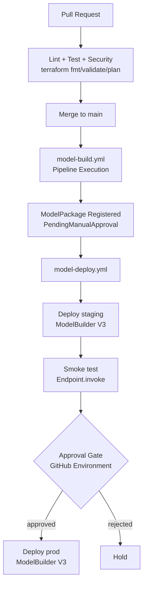

# 05 CI/CD GitHub Actions

## Objetivo y contexto
Automatizar el ciclo completo de `ModelBuild` y `ModelDeploy` con GitHub Actions.
Al cerrar esta fase, un push a `main` dispara entrenamiento, evaluacion y registro;
la promocion a `prod` requiere aprobacion manual via GitHub Environments.

Estado actual: **backlog ejecutable** -- no implementado end-to-end, pero con todos los
bloques y comandos concretos necesarios para cerrar la fase cuando se ejecute.

## Resultado minimo esperado
1. Workflow `model-build.yml` operativo en `main`.
2. Workflow `model-deploy.yml` operativo con gate manual para `prod`.
3. `main` dispara `ModelBuild` automaticamente.
4. `ModelDeploy` promueve a `prod` solo con aprobacion manual.
5. Artefactos CI/CD incluyen `PipelineExecutionArn`, `ModelPackageArn`, `EndpointArn`.

## Fuentes oficiales usadas en esta fase
1. `https://docs.github.com/actions/using-workflows/workflow-syntax-for-github-actions`
2. `https://docs.github.com/actions/deployment/targeting-different-environments/using-environments-for-deployment`
3. `https://docs.aws.amazon.com/IAM/latest/UserGuide/id_roles_providers_create_oidc.html`
4. `https://docs.aws.amazon.com/STS/latest/APIReference/API_AssumeRoleWithWebIdentity.html`
5. SageMaker V3 Pipeline SDK: `vendor/sagemaker-python-sdk/docs/ml_ops/index.rst`
6. SageMaker V3 ModelBuilder: `vendor/sagemaker-python-sdk/docs/inference/index.rst`

## Prerequisitos concretos
1. Fases 00-04 completadas (pipeline funcional, endpoint operativo).
2. Repositorio en GitHub con Actions habilitadas.
3. OIDC provider configurado en AWS para GitHub Actions.
4. GitHub Environment `prod` creado con required reviewers.
5. SageMaker SDK V3 instalado en el runner de CI.

## Arquitectura CI/CD (Mermaid)



## Autenticacion: OIDC para GitHub Actions

### Terraform para OIDC Provider

```hcl
# terraform/05_cicd/oidc.tf

resource "aws_iam_openid_connect_provider" "github" {
  url             = "https://token.actions.githubusercontent.com"
  client_id_list  = ["sts.amazonaws.com"]
  thumbprint_list = ["6938fd4d98bab03faadb97b34396831e3780aea1"]

  tags = {
    project    = "titanic-sagemaker"
    env        = var.environment
    managed_by = "terraform"
  }
}

resource "aws_iam_role" "github_actions" {
  name = "titanic-github-actions-${var.environment}"

  assume_role_policy = jsonencode({
    Version = "2012-10-17"
    Statement = [
      {
        Effect = "Allow"
        Principal = {
          Federated = aws_iam_openid_connect_provider.github.arn
        }
        Action = "sts:AssumeRoleWithWebIdentity"
        Condition = {
          StringEquals = {
            "token.actions.githubusercontent.com:aud" = "sts.amazonaws.com"
          }
          StringLike = {
            "token.actions.githubusercontent.com:sub" = "repo:<org>/<repo>:*"
          }
        }
      }
    ]
  })

  tags = {
    project    = "titanic-sagemaker"
    env        = var.environment
    managed_by = "terraform"
  }
}

# Attach policies for SageMaker pipeline, model registry, endpoint management
resource "aws_iam_role_policy_attachment" "github_actions_sagemaker" {
  role       = aws_iam_role.github_actions.name
  policy_arn = aws_iam_policy.github_actions_sagemaker.arn
}
```

Reemplazar `<org>/<repo>` con el repositorio real (e.g., `myorg/titanic_sagemaker`).

## Workflow: model-build.yml

```yaml
# .github/workflows/model-build.yml
name: ModelBuild

on:
  push:
    branches: [main]
    paths:
      - 'pipeline/**'
      - 'scripts/**'
      - 'terraform/03_sagemaker_pipeline/**'
  workflow_dispatch:

permissions:
  id-token: write
  contents: read

env:
  AWS_REGION: eu-west-1
  PIPELINE_NAME: titanic-modelbuild-dev

jobs:
  checks:
    runs-on: ubuntu-latest
    steps:
      - uses: actions/checkout@v4
      - name: Terraform fmt
        run: terraform -chdir=terraform/03_sagemaker_pipeline fmt -check
      - name: Terraform validate
        run: |
          terraform -chdir=terraform/03_sagemaker_pipeline init -backend=false
          terraform -chdir=terraform/03_sagemaker_pipeline validate
      - name: Python lint
        run: |
          pip install ruff
          ruff check pipeline/ scripts/

  build:
    needs: checks
    runs-on: ubuntu-latest
    outputs:
      pipeline_execution_arn: ${{ steps.start.outputs.execution_arn }}
      model_package_arn: ${{ steps.registry.outputs.model_package_arn }}
    steps:
      - uses: actions/checkout@v4

      - name: Configure AWS credentials (OIDC)
        uses: aws-actions/configure-aws-credentials@e3dd6a429d7300a6a4c196c26e071d42e0343502
        with:
          role-to-assume: ${{ secrets.AWS_ROLE_ARN }}
          aws-region: ${{ env.AWS_REGION }}

      - name: Install SageMaker SDK V3
        run: pip install "sagemaker>=3.5.0"

      - name: Package pipeline code
        run: |
          GIT_SHA=${{ github.sha }}
          DATA_BUCKET=$(aws ssm get-parameter --name /titanic/data-bucket --query Parameter.Value --output text)
          CODE_BUNDLE_URI="s3://${DATA_BUCKET}/pipeline/code/${GIT_SHA}/pipeline_code.tar.gz"

          tar -czf /tmp/pipeline_code.tar.gz -C pipeline/code .
          aws s3 cp /tmp/pipeline_code.tar.gz "${CODE_BUNDLE_URI}"

          echo "code_bundle_uri=${CODE_BUNDLE_URI}" >> $GITHUB_OUTPUT
          echo "data_bucket=${DATA_BUCKET}" >> $GITHUB_OUTPUT
        id: package

      - name: Start pipeline execution
        id: start
        run: |
          EXECUTION_ARN=$(aws sagemaker start-pipeline-execution \
            --pipeline-name ${{ env.PIPELINE_NAME }} \
            --pipeline-parameters '[
              {"Name": "CodeBundleUri", "Value": "${{ steps.package.outputs.code_bundle_uri }}"},
              {"Name": "InputTrainUri", "Value": "s3://${{ steps.package.outputs.data_bucket }}/curated/train.csv"},
              {"Name": "InputValidationUri", "Value": "s3://${{ steps.package.outputs.data_bucket }}/curated/validation.csv"},
              {"Name": "AccuracyThreshold", "Value": "0.78"}
            ]' \
            --query PipelineExecutionArn --output text)

          echo "execution_arn=${EXECUTION_ARN}" >> $GITHUB_OUTPUT
          echo "Pipeline started: ${EXECUTION_ARN}"

      - name: Wait for pipeline completion
        run: |
          while true; do
            STATUS=$(aws sagemaker describe-pipeline-execution \
              --pipeline-execution-arn ${{ steps.start.outputs.execution_arn }} \
              --query PipelineExecutionStatus --output text)
            echo "Status: ${STATUS}"
            if [ "${STATUS}" = "Succeeded" ] || [ "${STATUS}" = "Failed" ] || [ "${STATUS}" = "Stopped" ]; then
              break
            fi
            sleep 30
          done
          [ "${STATUS}" = "Succeeded" ] || exit 1

      - name: Get latest model package
        id: registry
        run: |
          MODEL_PKG_ARN=$(aws sagemaker list-model-packages \
            --model-package-group-name titanic-survival-xgboost \
            --sort-by CreationTime --sort-order Descending \
            --max-results 1 \
            --query 'ModelPackageSummaryList[0].ModelPackageArn' --output text)
          echo "model_package_arn=${MODEL_PKG_ARN}" >> $GITHUB_OUTPUT
          echo "Model registered: ${MODEL_PKG_ARN}"

      - name: Upload evidence
        uses: actions/upload-artifact@v4
        with:
          name: model-build-evidence
          path: |
            pipeline/code/
```

## Workflow: model-deploy.yml

```yaml
# .github/workflows/model-deploy.yml
name: ModelDeploy

on:
  workflow_dispatch:
    inputs:
      model_package_arn:
        description: 'ModelPackageArn to deploy'
        required: true
        type: string

permissions:
  id-token: write
  contents: read

env:
  AWS_REGION: eu-west-1

jobs:
  deploy-staging:
    runs-on: ubuntu-latest
    outputs:
      smoke_pass: ${{ steps.smoke.outputs.pass }}
    steps:
      - uses: actions/checkout@v4

      - name: Configure AWS credentials (OIDC)
        uses: aws-actions/configure-aws-credentials@e3dd6a429d7300a6a4c196c26e071d42e0343502
        with:
          role-to-assume: ${{ secrets.AWS_ROLE_ARN }}
          aws-region: ${{ env.AWS_REGION }}

      - name: Install SageMaker SDK V3
        run: pip install "sagemaker>=3.5.0"

      - name: Approve model package
        run: |
          aws sagemaker update-model-package \
            --model-package-arn ${{ inputs.model_package_arn }} \
            --model-approval-status Approved

      - name: Deploy staging endpoint
        run: |
          python3 -c "
          import boto3
          from sagemaker.core.helper.session_helper import Session
          from sagemaker.serve.model_builder import ModelBuilder

          session = Session()
          sm = boto3.client('sagemaker')

          mp = sm.describe_model_package(ModelPackageName='${{ inputs.model_package_arn }}')
          container = mp['InferenceSpecification']['Containers'][0]

          builder = ModelBuilder(
              s3_model_data_url=container['ModelDataUrl'],
              image_uri=container['Image'],
              sagemaker_session=session,
              role_arn='${{ secrets.SAGEMAKER_ROLE_ARN }}',
          )
          builder.build(model_name='titanic-staging-ci')
          builder.deploy(
              endpoint_name='titanic-survival-staging',
              instance_type='ml.m5.large',
              initial_instance_count=1,
          )
          print('Staging endpoint deployed')
          "

      - name: Smoke test staging
        id: smoke
        run: |
          RESULT=$(aws sagemaker-runtime invoke-endpoint \
            --endpoint-name titanic-survival-staging \
            --content-type text/csv \
            --body '3,0,22,1,0,7.25,2' \
            /tmp/staging_pred.txt \
            --query ContentType --output text)
          PRED=$(cat /tmp/staging_pred.txt)
          echo "Prediction: ${PRED}"
          [ -n "${PRED}" ] && echo "pass=true" >> $GITHUB_OUTPUT || echo "pass=false" >> $GITHUB_OUTPUT

  deploy-prod:
    needs: deploy-staging
    runs-on: ubuntu-latest
    if: needs.deploy-staging.outputs.smoke_pass == 'true'
    environment: prod  # Requires manual approval
    steps:
      - uses: actions/checkout@v4

      - name: Configure AWS credentials (OIDC)
        uses: aws-actions/configure-aws-credentials@e3dd6a429d7300a6a4c196c26e071d42e0343502
        with:
          role-to-assume: ${{ secrets.AWS_ROLE_ARN }}
          aws-region: ${{ env.AWS_REGION }}

      - name: Install SageMaker SDK V3
        run: pip install "sagemaker>=3.5.0"

      - name: Deploy prod endpoint
        run: |
          python3 -c "
          import boto3
          from sagemaker.core.helper.session_helper import Session
          from sagemaker.serve.model_builder import ModelBuilder

          session = Session()
          sm = boto3.client('sagemaker')

          mp = sm.describe_model_package(ModelPackageName='${{ inputs.model_package_arn }}')
          container = mp['InferenceSpecification']['Containers'][0]

          builder = ModelBuilder(
              s3_model_data_url=container['ModelDataUrl'],
              image_uri=container['Image'],
              sagemaker_session=session,
              role_arn='${{ secrets.SAGEMAKER_ROLE_ARN }}',
          )
          builder.build(model_name='titanic-prod-ci')
          builder.deploy(
              endpoint_name='titanic-survival-prod',
              instance_type='ml.m5.large',
              initial_instance_count=1,
          )
          print('Prod endpoint deployed')
          "

      - name: Verify prod endpoint
        run: |
          aws sagemaker describe-endpoint \
            --endpoint-name titanic-survival-prod \
            --query EndpointStatus --output text
```

## Decisiones tecnicas y alternativas descartadas
1. Dos workflows separados (`ModelBuild` y `ModelDeploy`) para desacoplar riesgo.
2. OIDC para GitHub Actions (evitar access keys estaticas en CI).
3. SageMaker SDK V3 (`ModelBuilder`, `pipeline.start()`) como interfaz principal en CI.
4. `ModelRegistry` es contrato obligatorio entre build y deploy.
5. GitHub Environment `prod` con required reviewers como gate de aprobacion.
6. Descartado: deploy directo a `prod` sin `staging` ni aprobacion manual.
7. Descartado: access keys estaticas para CI/CD.

## IAM usado (roles/policies/permisos clave)
1. Identidad base del proyecto: `data-science-user`.
2. En CI/CD: role asumible por OIDC (least privilege por entorno).
3. Permisos minimos del role CI/CD:
   - `sagemaker:StartPipelineExecution`, `DescribePipelineExecution`, `ListPipelineExecutionSteps`
   - `sagemaker:ListModelPackages`, `DescribeModelPackage`, `UpdateModelPackage`
   - `sagemaker:CreateModel`, `CreateEndpointConfig`, `CreateEndpoint`, `UpdateEndpoint`,
     `DescribeEndpoint`, `InvokeEndpoint`
   - `s3:GetObject`, `s3:PutObject` en bucket del proyecto
   - `iam:PassRole` restringido a roles SageMaker

## Criterios de aceptacion
1. PR checks operativos: `fmt/validate/plan/lint`.
2. `main` dispara `ModelBuild` y deja `ModelPackageArn` trazable.
3. `ModelDeploy` ejecuta `staging -> smoke -> approval -> prod`.
4. Artifacts de workflow incluyen `PipelineExecutionArn`, `ModelPackageArn`, endpoints.

## Evidencia requerida
1. Link al run de `model-build.yml` exitoso en `main`.
2. Link al run de `model-deploy.yml` con evidencia de aprobacion manual.
3. `PipelineExecutionArn` y estado por step.
4. `ModelPackageArn` promovido.
5. `EndpointArn` de `staging` y `prod`.

## Criterio de cierre
1. `model-build.yml` operativo en PR y `main`.
2. `model-deploy.yml` operativo con gate manual en `prod`.
3. Trazabilidad completa: commit -> pipeline -> model package -> endpoint.
4. Evidencia reproducible en `docs/iterations/`.

## Riesgos/pendientes
1. OIDC mal configurado (assume role falla en runtime).
2. Permisos excesivos por no segmentar roles dev/prod.
3. Promocion bloqueada si falta criterio estandar de smoke.
4. Runner de CI necesita `sagemaker>=3.5.0` instalado.

## Proximo paso
Implementar observabilidad en `docs/tutorials/06-observability-operations.md`.
