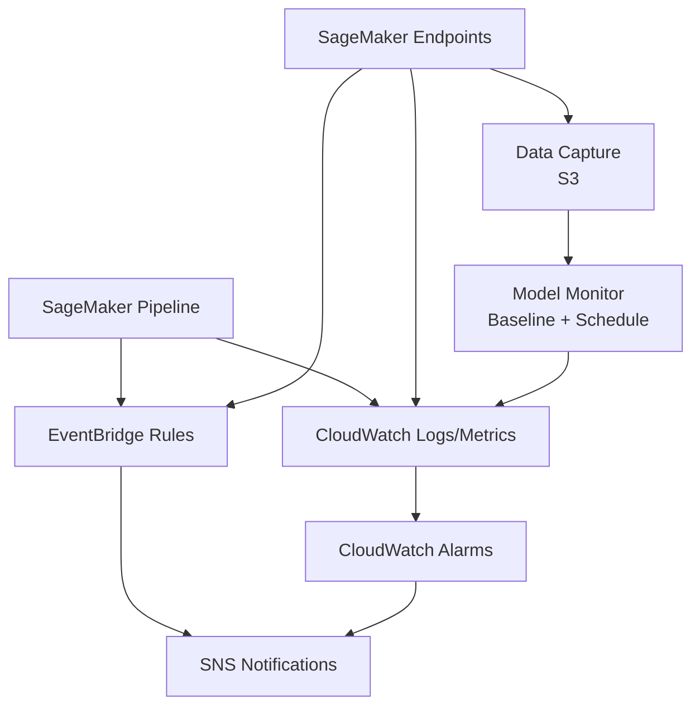

# 06 Observability and Operations

## Objetivo y contexto
Definir e implementar observabilidad operativa para el ciclo completo:
1. Ejecuciones de SageMaker Pipeline.
2. Endpoints de serving (`staging` y `prod`).
3. Monitoreo de drift/calidad de modelo.
4. Alertamiento y runbooks de respuesta.

Estado actual: **backlog ejecutable** -- no cerrado end-to-end, pero con todos los
comandos y configuraciones concretas para implementar cuando se alcance esta fase.

## Resultado minimo esperado
1. Alarmas de CloudWatch para fallos de pipeline y endpoints.
2. Reglas EventBridge para cambios de estado de pipeline/model/endpoint.
3. Data capture habilitado para Model Monitor.
4. Runbooks probados por sintoma critico.

## Fuentes oficiales usadas en esta fase
1. `https://docs.aws.amazon.com/sagemaker/latest/dg/logging-cloudwatch.html`
2. `https://docs.aws.amazon.com/sagemaker/latest/dg/monitoring-cloudwatch.html`
3. `https://docs.aws.amazon.com/sagemaker/latest/dg/model-monitor.html`
4. `https://docs.aws.amazon.com/sagemaker/latest/dg/model-monitor-data-capture.html`
5. `https://docs.aws.amazon.com/sagemaker/latest/dg/automating-sagemaker-with-eventbridge.html`
6. `https://docs.aws.amazon.com/AmazonCloudWatch/latest/APIReference/API_PutMetricAlarm.html`
7. SageMaker V3 Core resources: `vendor/sagemaker-python-sdk/sagemaker-core/src/sagemaker/core/resources.py`
8. SageMaker V3 Core shapes (DataCaptureConfig): `vendor/sagemaker-python-sdk/sagemaker-core/src/sagemaker/core/shapes.py`

## Prerequisitos concretos
1. Fases 00-04 completadas (pipeline y endpoints funcionales).
2. Perfil AWS CLI: `data-science-user`.
3. SageMaker SDK V3 instalado.
4. Al menos un endpoint `InService` para configurar data capture.

## Arquitectura de observabilidad (Mermaid)



## Entregable 1 -- Alarmas de CloudWatch

### 1.1 Alarma para fallos de pipeline

```bash
export AWS_PROFILE=data-science-user
export AWS_REGION=eu-west-1
export SNS_TOPIC_ARN="arn:aws:sns:${AWS_REGION}:<account-id>:titanic-alerts"

# Crear SNS topic (si no existe)
aws sns create-topic --name titanic-alerts \
  --profile "$AWS_PROFILE" --region "$AWS_REGION"

# Alarma por metricas custom de pipeline (requiere publicar metrica custom)
aws cloudwatch put-metric-alarm \
  --alarm-name "titanic-pipeline-failures" \
  --alarm-description "SageMaker Pipeline execution failures" \
  --namespace "AWS/SageMaker" \
  --metric-name "PipelineExecutionFailed" \
  --dimensions Name=PipelineName,Value=titanic-modelbuild-dev \
  --statistic Sum \
  --period 300 \
  --evaluation-periods 1 \
  --threshold 1 \
  --comparison-operator GreaterThanOrEqualToThreshold \
  --alarm-actions "$SNS_TOPIC_ARN" \
  --profile "$AWS_PROFILE" --region "$AWS_REGION"
```

### 1.2 Alarma para errores de endpoint

```bash
# 5xx errors en endpoint staging
aws cloudwatch put-metric-alarm \
  --alarm-name "titanic-staging-5xx" \
  --alarm-description "Staging endpoint 5xx errors" \
  --namespace "AWS/SageMaker" \
  --metric-name "Invocation5XXErrors" \
  --dimensions Name=EndpointName,Value=titanic-survival-staging \
               Name=VariantName,Value=AllTraffic \
  --statistic Sum \
  --period 300 \
  --evaluation-periods 2 \
  --threshold 5 \
  --comparison-operator GreaterThanOrEqualToThreshold \
  --alarm-actions "$SNS_TOPIC_ARN" \
  --profile "$AWS_PROFILE" --region "$AWS_REGION"

# Latencia alta P95 en endpoint prod
aws cloudwatch put-metric-alarm \
  --alarm-name "titanic-prod-latency-p95" \
  --alarm-description "Prod endpoint P95 latency > 2s" \
  --namespace "AWS/SageMaker" \
  --metric-name "ModelLatency" \
  --dimensions Name=EndpointName,Value=titanic-survival-prod \
               Name=VariantName,Value=AllTraffic \
  --extended-statistic p95 \
  --period 300 \
  --evaluation-periods 3 \
  --threshold 2000000 \
  --comparison-operator GreaterThanOrEqualToThreshold \
  --alarm-actions "$SNS_TOPIC_ARN" \
  --profile "$AWS_PROFILE" --region "$AWS_REGION"
```

### 1.3 Verificar alarmas

```bash
aws cloudwatch describe-alarms \
  --alarm-name-prefix "titanic-" \
  --profile "$AWS_PROFILE" --region "$AWS_REGION" \
  --query 'MetricAlarms[].{Name:AlarmName, State:StateValue}' \
  --output table
```

## Entregable 2 -- EventBridge para cambios de estado

### 2.1 Regla para cambio de estado de pipeline

```bash
aws events put-rule \
  --name "titanic-pipeline-state-change" \
  --event-pattern '{
    "source": ["aws.sagemaker"],
    "detail-type": ["SageMaker Pipeline Execution Status Change"],
    "detail": {
      "pipelineArn": [{"prefix": "arn:aws:sagemaker:'$AWS_REGION'"}],
      "currentPipelineExecutionStatus": ["Failed", "Stopped"]
    }
  }' \
  --profile "$AWS_PROFILE" --region "$AWS_REGION"

aws events put-targets \
  --rule "titanic-pipeline-state-change" \
  --targets "Id=sns-target,Arn=$SNS_TOPIC_ARN" \
  --profile "$AWS_PROFILE" --region "$AWS_REGION"
```

### 2.2 Regla para cambio de estado de model package

```bash
aws events put-rule \
  --name "titanic-model-approval-change" \
  --event-pattern '{
    "source": ["aws.sagemaker"],
    "detail-type": ["SageMaker Model Package State Change"],
    "detail": {
      "ModelApprovalStatus": ["Approved", "Rejected"]
    }
  }' \
  --profile "$AWS_PROFILE" --region "$AWS_REGION"

aws events put-targets \
  --rule "titanic-model-approval-change" \
  --targets "Id=sns-target,Arn=$SNS_TOPIC_ARN" \
  --profile "$AWS_PROFILE" --region "$AWS_REGION"
```

### 2.3 Regla para estado de endpoint

```bash
aws events put-rule \
  --name "titanic-endpoint-state-change" \
  --event-pattern '{
    "source": ["aws.sagemaker"],
    "detail-type": ["SageMaker Endpoint Status Change"],
    "detail": {
      "EndpointName": [{"prefix": "titanic-survival"}],
      "EndpointStatus": ["Failed", "OutOfService"]
    }
  }' \
  --profile "$AWS_PROFILE" --region "$AWS_REGION"

aws events put-targets \
  --rule "titanic-endpoint-state-change" \
  --targets "Id=sns-target,Arn=$SNS_TOPIC_ARN" \
  --profile "$AWS_PROFILE" --region "$AWS_REGION"
```

### 2.4 Verificar reglas

```bash
aws events list-rules \
  --name-prefix "titanic-" \
  --profile "$AWS_PROFILE" --region "$AWS_REGION" \
  --query 'Rules[].{Name:Name, State:State}' \
  --output table
```

## Entregable 3 -- Data Capture y Model Monitor

### 3.1 Habilitar Data Capture en endpoint (V3)

Al desplegar el endpoint con `ModelBuilder`, se puede agregar data capture config.
Alternativamente, se configura via boto3 en el `EndpointConfig`:

```python
import boto3

sm_client = boto3.client("sagemaker", region_name="eu-west-1")
DATA_BUCKET = "<from-terraform-output>"
ENDPOINT_NAME = "titanic-survival-staging"

# Crear endpoint config con data capture
sm_client.create_endpoint_config(
    EndpointConfigName=f"{ENDPOINT_NAME}-dc-config",
    ProductionVariants=[
        {
            "VariantName": "AllTraffic",
            "ModelName": "<model-name>",
            "InitialInstanceCount": 1,
            "InstanceType": "ml.m5.large",
            "InitialVariantWeight": 1.0,
        }
    ],
    DataCaptureConfig={
        "EnableCapture": True,
        "InitialSamplingPercentage": 100,
        "DestinationS3Uri": f"s3://{DATA_BUCKET}/monitoring/data-capture/{ENDPOINT_NAME}",
        "CaptureOptions": [
            {"CaptureMode": "Input"},
            {"CaptureMode": "Output"},
        ],
        "CaptureContentTypeHeader": {
            "CsvContentTypes": ["text/csv"],
        },
    },
)
```

### 3.2 Crear baseline de Model Monitor

```python
from sagemaker.core.helper.session_helper import Session
import boto3

boto_session = boto3.Session(profile_name="data-science-user", region_name="eu-west-1")
session = Session(boto_session=boto_session)
sm_client = boto_session.client("sagemaker")

# Crear baseline job
sm_client.create_monitoring_schedule(
    MonitoringScheduleName="titanic-data-quality-schedule",
    MonitoringScheduleConfig={
        "ScheduleConfig": {
            "ScheduleExpression": "cron(0 */6 ? * * *)",  # Cada 6 horas
        },
        "MonitoringJobDefinition": {
            "MonitoringInputs": [
                {
                    "EndpointInput": {
                        "EndpointName": "titanic-survival-prod",
                        "LocalPath": "/opt/ml/processing/input",
                    }
                }
            ],
            "MonitoringOutputConfig": {
                "MonitoringOutputs": [
                    {
                        "S3Output": {
                            "S3Uri": f"s3://{DATA_BUCKET}/monitoring/results",
                            "LocalPath": "/opt/ml/processing/output",
                            "S3UploadMode": "EndOfJob",
                        }
                    }
                ]
            },
            "MonitoringResources": {
                "ClusterConfig": {
                    "InstanceCount": 1,
                    "InstanceType": "ml.m5.large",
                    "VolumeSizeInGB": 20,
                }
            },
            "RoleArn": "<sagemaker-execution-role-arn>",
        },
    },
)
```

## Entregable 4 -- Terraform para observabilidad (alternativa IaC)

```hcl
# terraform/06_observability/alarms.tf

resource "aws_sns_topic" "alerts" {
  name = "titanic-alerts-${var.environment}"
  tags = { project = "titanic-sagemaker", env = var.environment }
}

resource "aws_cloudwatch_metric_alarm" "endpoint_5xx" {
  alarm_name          = "titanic-${var.environment}-endpoint-5xx"
  comparison_operator = "GreaterThanOrEqualToThreshold"
  evaluation_periods  = 2
  metric_name         = "Invocation5XXErrors"
  namespace           = "AWS/SageMaker"
  period              = 300
  statistic           = "Sum"
  threshold           = 5
  alarm_actions       = [aws_sns_topic.alerts.arn]

  dimensions = {
    EndpointName = "titanic-survival-${var.environment}"
    VariantName  = "AllTraffic"
  }

  tags = { project = "titanic-sagemaker", env = var.environment }
}

resource "aws_cloudwatch_event_rule" "pipeline_failure" {
  name = "titanic-pipeline-failure-${var.environment}"
  event_pattern = jsonencode({
    source      = ["aws.sagemaker"]
    detail-type = ["SageMaker Pipeline Execution Status Change"]
    detail = {
      currentPipelineExecutionStatus = ["Failed"]
    }
  })
  tags = { project = "titanic-sagemaker", env = var.environment }
}

resource "aws_cloudwatch_event_target" "pipeline_failure_sns" {
  rule      = aws_cloudwatch_event_rule.pipeline_failure.name
  target_id = "sns-target"
  arn       = aws_sns_topic.alerts.arn
}
```

## Runbook por sintoma (obligatorio)
| Sintoma | Causa raiz probable | Accion inmediata | Evidencia a guardar |
|---|---|---|---|
| Endpoint no responde | Endpoint `Failed` o config invalido | `DescribeEndpoint` -> revisar `FailureReason` -> rollback | ARN, estado, timestamp, config |
| Regresion tras promocion | Modelo no cumple comportamiento | Congelar promocion, rollback `UpdateEndpoint` | `ModelPackageArn`, smoke results |
| Pipeline drift/fallo recurrente | Cambio no controlado en datos/codigo/IAM | Revisar steps fallidos en CloudWatch | `PipelineExecutionArn`, step status |
| Data capture no registra | `EnableCapture=false` o IAM insuficiente | Verificar `EndpointConfig` y permisos S3 | Config actual, policy adjunta |
| Alarma falsa recurrente | Umbral sin calibrar | Ajustar threshold o periodo | Historico de alarmas |

## Comandos de verificacion operativa

```bash
export AWS_PROFILE=data-science-user
export AWS_REGION=eu-west-1

# Alarmas
aws cloudwatch describe-alarms \
  --alarm-name-prefix "titanic-" \
  --profile "$AWS_PROFILE" --region "$AWS_REGION"

# Eventos SageMaker en EventBridge
aws events list-rules \
  --name-prefix "titanic-" \
  --profile "$AWS_PROFILE" --region "$AWS_REGION"

# Logs de endpoints y jobs
aws logs describe-log-groups \
  --log-group-name-prefix "/aws/sagemaker" \
  --profile "$AWS_PROFILE" --region "$AWS_REGION"

# Data capture
aws s3 ls s3://$DATA_BUCKET/monitoring/data-capture/ \
  --recursive --profile "$AWS_PROFILE"

# Monitoring schedules
aws sagemaker list-monitoring-schedules \
  --profile "$AWS_PROFILE" --region "$AWS_REGION"
```

## Criterio de cierre
1. Alarmas criticas definidas y en estado `OK`.
2. Eventos de estado conectados por EventBridge.
3. Data capture habilitado en al menos un endpoint.
4. Baseline/schedule de Model Monitor configurado.
5. Runbooks operativos documentados y probados.

## Riesgos/pendientes
1. Fatiga de alertas por umbrales sin calibracion.
2. Coste adicional de captura/monitor sin politica de retencion.
3. Falta de ownership por alerta si no se asigna responsable.

## Proximo paso
Implementar gobierno de costos en `docs/tutorials/07-cost-governance.md`.
