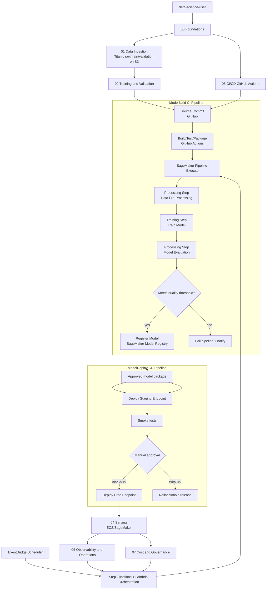

# Tutorial roadmap

Tutoriales por fase del proyecto Titanic SageMaker:

1. `docs/tutorials/00-foundations.md`
2. `docs/tutorials/01-data-ingestion.md`
3. `docs/tutorials/02-training-validation.md`
4. `docs/tutorials/03-sagemaker-pipeline.md`
5. `docs/tutorials/04-serving-ecs-sagemaker.md`
6. `docs/tutorials/05-cicd-github-actions.md`
7. `docs/tutorials/06-observability-operations.md`
8. `docs/tutorials/07-cost-governance.md`

## How to run this roadmap step by step
1. Completa `00-foundations.md` y valida identidad/perfil + base Terraform.
2. Ejecuta `01-data-ingestion.md` y deja `raw/train/validation` en S3.
3. Ejecuta `02-training-validation.md` y documenta umbral + resultado `pass/fail`.
4. Ejecuta `03-sagemaker-pipeline.md` y registra modelo en Model Registry.
5. Ejecuta `04-serving-ecs-sagemaker.md` con despliegue `staging -> approval -> prod`.
6. Automatiza el flujo con `05-cicd-github-actions.md`.
7. Cierra operación con `06-observability-operations.md`.
8. Cierra gobierno de costos con `07-cost-governance.md`.

Criterio global de finalizacion:
- Existe ejecución reproducible de punta a punta.
- Hay trazabilidad desde commit hasta modelo en registry y endpoint en `prod`.
- Hay evidencia operativa y de costo registrada en `docs/iterations/`.

## End-to-End process (Mermaid)

Arquitectura objetivo:
- Equivalente funcional a la imagen de referencia: **ModelBuild -> Model Registry -> ModelDeploy (Staging -> Manual Approval -> Prod)**.
- En este proyecto, la implementacion recomendada usa `GitHub + GitHub Actions + Terraform` como reemplazo de `CodeCommit/CodeBuild/CodePipeline/CloudFormation`.

## Titanic dataset files (local source of truth)
- `data/titanic/raw/titanic.csv` (dataset fuente)
- `data/titanic/splits/train.csv` (dataset de entrenamiento)
- `data/titanic/splits/validation.csv` (dataset de validacion)

Iteraciones historicas:
- `docs/iterations/`

Convencion de credenciales para todos los tutoriales:
- IAM user: `data-science-user`
- Access keys logicas: `data-science-user-primary` y `data-science-user-rotation`
- Perfil AWS CLI: `data-science-user`

Regla global de ejecucion AWS:
- Toda operacion AWS del proyecto debe ejecutarse desde `data-science-user` como identidad principal.
- Para trabajo por entorno mantener el mismo perfil `data-science-user` y cambiar solo recursos/variables de entorno.
