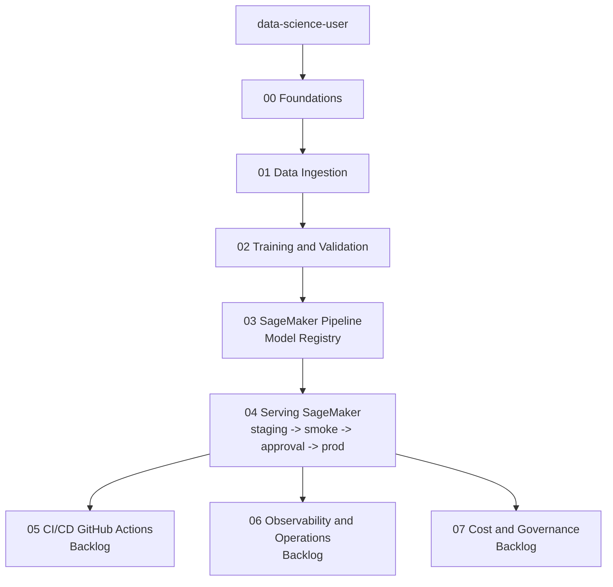

# Tutorial roadmap

Tutoriales por fase del proyecto Titanic SageMaker:

1. `docs/tutorials/00-foundations.md`
2. `docs/tutorials/01-data-ingestion.md`
3. `docs/tutorials/02-training-validation.md`
4. `docs/tutorials/03-sagemaker-pipeline.md`
5. `docs/tutorials/04-serving-sagemaker.md`
6. `docs/tutorials/05-cicd-github-actions.md`
7. `docs/tutorials/06-observability-operations.md`
8. `docs/tutorials/07-cost-governance.md`

## Estado actual del roadmap
1. Fases `00-03`: implementadas y alineadas al estado real del repositorio.
2. Fase `04`: siguiente paso ejecutable inmediato (SageMaker serving only: `staging -> smoke -> approval -> prod`).
3. Fases `05-07`: backlog planificado con gates de cierre; no deben asumirse como cerradas hasta cumplir criterios de aceptacion.

## How to run this roadmap step by step
1. Completa `00-foundations.md` y valida identidad/perfil + base Terraform.
2. Ejecuta `01-data-ingestion.md` y deja `raw/train/validation` en S3.
3. Ejecuta `02-training-validation.md` como ensayo manual de calidad.
4. Ejecuta `03-sagemaker-pipeline.md` y registra modelo en Model Registry.
5. Ejecuta `04-serving-sagemaker.md` como fase de serving (sin requerir ECS para cierre).
6. Implementa backlog de `05-cicd-github-actions.md`.
7. Implementa backlog de `06-observability-operations.md`.
8. Implementa backlog de `07-cost-governance.md`.

Criterio global de finalizacion:
- Flujo reproducible de punta a punta.
- Trazabilidad desde commit hasta modelo registrado y endpoint activo.
- Evidencia operativa y de costo registrada en `docs/iterations/`.

## Reset de estado por tutorial
Script oficial:
- `scripts/reset_tutorial_state.sh`

Modos:
1. Reset fase 02 (mantiene `raw/` y `curated/`):
   - `scripts/reset_tutorial_state.sh --target after-tutorial-2`
   - `scripts/reset_tutorial_state.sh --target after-tutorial-2 --apply --confirm RESET`
2. Reset completo del tutorial (conserva bucket e IAM):
   - `scripts/reset_tutorial_state.sh --target all`
   - `scripts/reset_tutorial_state.sh --target all --apply --confirm RESET`

Guardrails:
- `dry-run` por defecto.
- Perfil obligatorio `data-science-user`.
- Borrado real solo con `--apply --confirm RESET`.

## Verificacion de recursos activos (operacion/costo)
Script oficial:
- `scripts/check_tutorial_resources_active.sh`

Modos recomendados:
1. Revision global de recursos del roadmap:
   - `AWS_PROFILE=data-science-user scripts/check_tutorial_resources_active.sh --phase all`
2. Revision puntual por fase:
   - `AWS_PROFILE=data-science-user scripts/check_tutorial_resources_active.sh --phase 04`
   - `AWS_PROFILE=data-science-user scripts/check_tutorial_resources_active.sh --phase 07`
3. Gate para CI/smoke de gobierno:
   - `AWS_PROFILE=data-science-user scripts/check_tutorial_resources_active.sh --phase all --fail-if-active`

Salida esperada:
- Resumen por servicio con conteos `active`, `inactive`, `unknown`.
- Detalle de recursos filtrados por `project=titanic-sagemaker` o prefijo `titanic-`.
- Warnings sin abortar en caso de permisos faltantes por servicio.

## End-to-End process (Mermaid)

## Titanic dataset files (local source of truth)
- `data/titanic/raw/titanic.csv` (dataset fuente)
- `data/titanic/splits/train.csv` (dataset de entrenamiento)
- `data/titanic/splits/validation.csv` (dataset de validacion)

Iteraciones historicas:
- `docs/iterations/`

Convencion de credenciales para todos los tutoriales:
- IAM user: `data-science-user`
- Access keys logicas: `data-science-user-primary` y `data-science-user-rotation`
- Perfil AWS CLI: `data-science-user`

Regla global de ejecucion AWS:
- Toda operacion AWS del proyecto debe ejecutarse desde `data-science-user` como identidad principal.
- Para trabajo por entorno mantener el mismo perfil `data-science-user` y cambiar solo recursos/variables de entorno.
