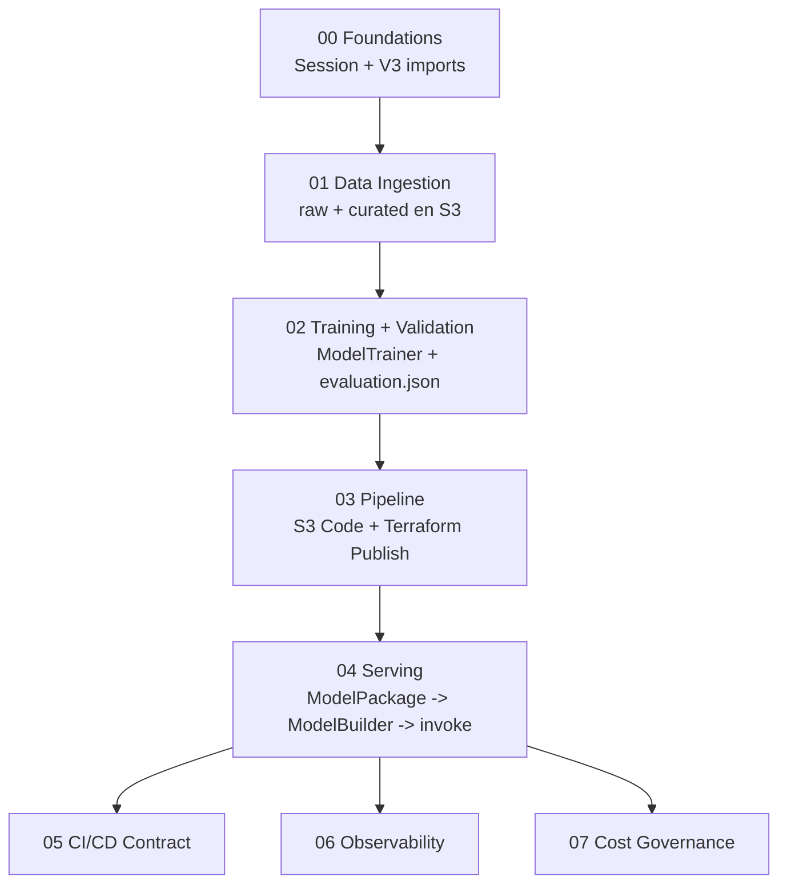

# Tutorial roadmap

Roadmap oficial del proyecto Titanic SageMaker, alineado solo con la documentacion local del
SageMaker Python SDK V3 y con los archivos del repositorio.

## Orden de ejecucion
1. `docs/tutorials/00-foundations.md`
2. `docs/tutorials/01-data-ingestion.md`
3. `docs/tutorials/02-training-validation.md`
4. `docs/tutorials/03-sagemaker-pipeline.md`
5. `docs/tutorials/04-serving-sagemaker.md`
6. `docs/tutorials/05-cicd-github-actions.md`
7. `docs/tutorials/06-observability-operations.md`
8. `docs/tutorials/07-cost-governance.md`

## Fuente de verdad del roadmap
Solo se consideran fuentes normativas de SageMaker para este roadmap:
- `vendor/sagemaker-python-sdk/docs/`
- `vendor/sagemaker-python-sdk/docs/api/`
- `vendor/sagemaker-python-sdk/v3-examples/`
- `vendor/sagemaker-python-sdk/migration.md`

Los scripts y archivos del repo se usan como implementacion local del proyecto, pero no se
tratan como autoridad para inventar APIs distintas a las documentadas en el SDK vendoreado.

## Principios del roadmap
1. `ModelTrainer` reemplaza patrones V2 de training.
2. `ModelBuilder` reemplaza patrones V2 de deployment e inferencia.
3. `PipelineSession`, `ProcessingStep`, `TrainingStep`, `ConditionStep` y `ModelStep` son la
   base del flujo MLOps.
4. `endpoint.invoke(...)` es el patron canonico de inferencia en tiempo real.
5. Todo deploy gobernado pasa por `ModelPackageArn`.
6. Toda operacion AWS del proyecto se ejecuta con el perfil `data-science-user`.

## Estado por tutorial
1. `00-foundations.md`: setup V3, `Session()` y convenciones del repo.
2. `01-data-ingestion.md`: carga del dataset local del repo a S3.
3. `02-training-validation.md`: baseline manual con `ModelTrainer` + `evaluation.json`.
4. `03-sagemaker-pipeline.md`: pipeline durable con mapping V3, codigo en S3 del proyecto y publicacion via Terraform.
5. `04-serving-sagemaker.md`: deploy desde `ModelPackageArn` con `ModelBuilder`.
6. `05-cicd-github-actions.md`: contrato SageMaker del workflow, sin sintaxis externa al SDK.
7. `06-observability-operations.md`: runbook operativo centrado en recursos de SageMaker.
8. `07-cost-governance.md`: cleanup y gobierno de costo centrados en recursos de SageMaker.

## Flujo end-to-end del roadmap

```mermaid
flowchart TD
  F0[00 Foundations\nSession + V3 imports] --> D1[01 Data Ingestion\nraw + curated en S3]
  D1 --> T2[02 Training + Validation\nModelTrainer + evaluation.json]
  T2 --> P3[03 Pipeline\nS3 Code + Terraform Publish]
  P3 --> S4[04 Serving\nModelPackage -> ModelBuilder -> invoke]
  S4 --> C5[05 CI/CD Contract]
  S4 --> O6[06 Observability]
  S4 --> G7[07 Cost Governance]
```

## Scripts operativos del roadmap
- `scripts/prepare_titanic_splits.py`
- `scripts/prepare_titanic_xgboost_inputs.py`
- `scripts/check_tutorial_resources_active.sh`
- `scripts/reset_tutorial_state.sh`
- `scripts/publish_pipeline_code.sh`
- `pipeline/code/preprocess.py`
- `pipeline/code/evaluate.py`

## Convencion de credenciales
- IAM user: `data-science-user`
- AWS CLI profile: `data-science-user`
- Runtime execution role: `SAGEMAKER_EXECUTION_ROLE_ARN` o `get_execution_role()` en
  entornos gestionados por SageMaker

## Criterio global de finalizacion
- Existe trazabilidad desde dataset local hasta `ModelPackageArn` y endpoint activo.
- Las fases no dependen de patrones V2 ni de documentacion externa al SDK vendoreado.
- La evidencia operativa se registra en `docs/iterations/`.
