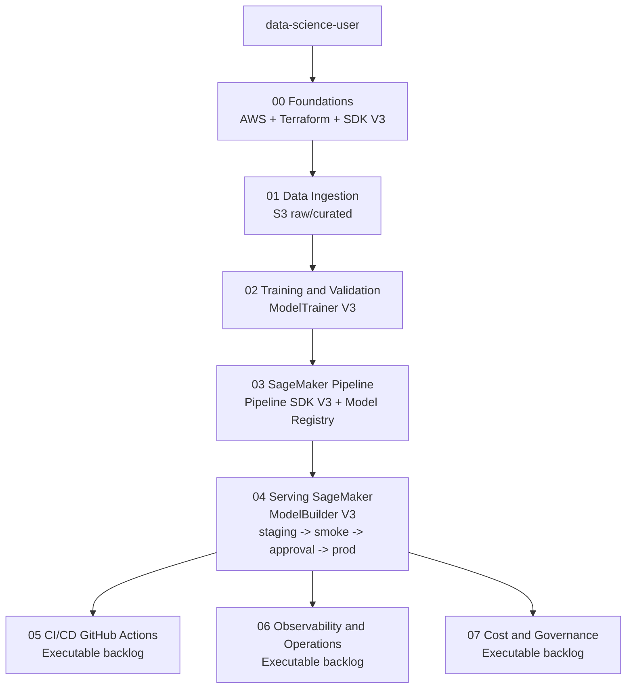

# Tutorial roadmap

Roadmap oficial de tutoriales del proyecto Titanic SageMaker (alineado a SDK V3):

1. `docs/tutorials/00-foundations.md`
2. `docs/tutorials/01-data-ingestion.md`
3. `docs/tutorials/02-training-validation.md`
4. `docs/tutorials/03-sagemaker-pipeline.md`
5. `docs/tutorials/04-serving-sagemaker.md`
6. `docs/tutorials/05-cicd-github-actions.md`
7. `docs/tutorials/06-observability-operations.md`
8. `docs/tutorials/07-cost-governance.md`

## Principios del roadmap
1. Cada tutorial es autocontenido: objetivo, prerequisitos, comandos, validacion y evidencia.
2. Toda guia de SageMaker usa patrones SDK V3 (`sagemaker>=3.5.0`).
3. Toda operacion AWS se ejecuta con el perfil `data-science-user`.
4. No se considera una fase cerrada sin evidencia en `docs/iterations/`.

## Alineacion con documentacion oficial local
Fuente de verdad para SDK:
- `vendor/sagemaker-python-sdk/docs/`
- `vendor/sagemaker-python-sdk/docs/api/`
- `vendor/sagemaker-python-sdk/v3-examples/`
- `vendor/sagemaker-python-sdk/migration.md`

Estado por tutorial:
1. `00-foundations.md`: base AWS/IAM/Terraform + setup de SageMaker SDK V3.
2. `01-data-ingestion.md`: ingestion S3 y validacion de acceso con `Session` V3.
3. `02-training-validation.md`: training manual con `ModelTrainer` V3 + evaluacion.
4. `03-sagemaker-pipeline.md`: pipeline SDK-driven V3 (`Pipeline`, `TrainingStep`, `ModelStep`).
5. `04-serving-sagemaker.md`: serving con `ModelBuilder` V3 + gate `staging -> prod`.
6. `05-cicd-github-actions.md`: backlog ejecutable de CI/CD con OIDC + SageMaker V3.
7. `06-observability-operations.md`: backlog ejecutable de alarmas, EventBridge y monitor.
8. `07-cost-governance.md`: backlog ejecutable de budgets, tags y control de recursos.

## How to run this roadmap step by step
1. Completa `00-foundations.md` (identidad, perfil, SDK V3, base Terraform).
2. Ejecuta `01-data-ingestion.md` y deja `raw/curated` en S3.
3. Ejecuta `02-training-validation.md` para baseline de calidad.
4. Ejecuta `03-sagemaker-pipeline.md` y registra modelo en Model Registry.
5. Ejecuta `04-serving-sagemaker.md` para publicar `staging` y luego `prod`.
6. Implementa `05-cicd-github-actions.md` para automatizar build/deploy.
7. Implementa `06-observability-operations.md` para alarmas y runbooks.
8. Implementa `07-cost-governance.md` para presupuesto y control de gasto.

Criterio global de finalizacion:
- Flujo reproducible de punta a punta.
- Trazabilidad desde commit hasta modelo registrado y endpoint activo.
- Evidencia operativa y de costo en `docs/iterations/`.

## End-to-End process (Mermaid)

```mermaid
flowchart TD
  U[data-science-user] --> F0[00 Foundations\nAWS + Terraform + SDK V3]
  F0 --> D1[01 Data Ingestion\nS3 raw/curated]
  D1 --> B2[02 Training and Validation\nModelTrainer V3]
  B2 --> P3[03 SageMaker Pipeline\nPipeline SDK V3 + Model Registry]
  P3 --> S4[04 Serving SageMaker\nModelBuilder V3\nstaging -> smoke -> approval -> prod]

  S4 --> C5[05 CI/CD GitHub Actions\nExecutable backlog]
  S4 --> O6[06 Observability and Operations\nExecutable backlog]
  S4 --> G7[07 Cost and Governance\nExecutable backlog]
```

## Scripts operativos del roadmap

### Reset de estado
Script oficial:
- `scripts/reset_tutorial_state.sh`

Modos:
1. Reset fase 02 (mantiene `raw/` y `curated/`):
   - `scripts/reset_tutorial_state.sh --target after-tutorial-2`
   - `scripts/reset_tutorial_state.sh --target after-tutorial-2 --apply --confirm RESET`
2. Reset completo del tutorial (conserva bucket e IAM):
   - `scripts/reset_tutorial_state.sh --target all`
   - `scripts/reset_tutorial_state.sh --target all --apply --confirm RESET`

Guardrails:
- `dry-run` por defecto.
- Perfil obligatorio `data-science-user`.
- Borrado real solo con `--apply --confirm RESET`.

### Verificacion de recursos activos
Script oficial:
- `scripts/check_tutorial_resources_active.sh`

Modos recomendados:
1. Revision global:
   - `AWS_PROFILE=data-science-user scripts/check_tutorial_resources_active.sh --phase all`
2. Revision por fase:
   - `AWS_PROFILE=data-science-user scripts/check_tutorial_resources_active.sh --phase 04`
   - `AWS_PROFILE=data-science-user scripts/check_tutorial_resources_active.sh --phase 07`
3. Gate de CI/smoke:
   - `AWS_PROFILE=data-science-user scripts/check_tutorial_resources_active.sh --phase all --fail-if-active`

## Titanic dataset files (local source of truth)
- `data/titanic/raw/titanic.csv`
- `data/titanic/splits/train.csv`
- `data/titanic/splits/validation.csv`

## Convencion de credenciales
- IAM user: `data-science-user`
- Access keys logicas: `data-science-user-primary` y `data-science-user-rotation`
- Perfil AWS CLI: `data-science-user`

Regla global:
- Toda operacion AWS del proyecto debe ejecutarse desde `data-science-user`.
- Para trabajo por entorno mantener el mismo perfil y cambiar solo recursos/variables.

## Iteraciones historicas
- `docs/iterations/`
