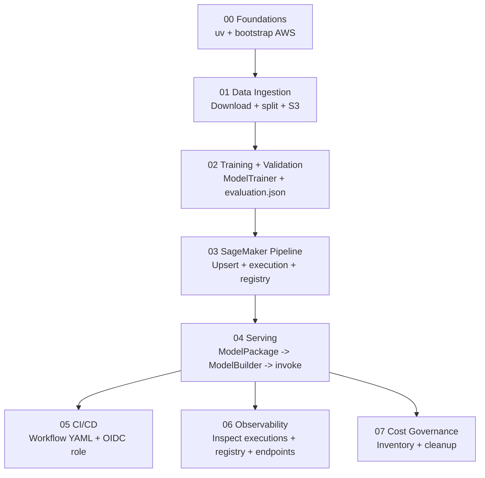

# Roadmap autocontenido

Este folder es el roadmap completo del proyecto Titanic SageMaker. La regla de uso es simple:
solo necesitas estos tutoriales, una cuenta AWS ya preparada para `data-science-user`, `uv` y
AWS CLI.

## Antes de empezar

1. Configura el perfil AWS CLI `data-science-user`.
2. Ten disponibles estos bundles IAM segun la fase:
   - `DataScienceTutorialBootstrap` para `00` y el bootstrap OIDC de `05`
   - `DataScienceTutorialOperator` para `01` a `06`
   - `DataScienceTutorialCleanup` para borrados guiados de `04` y `07`
3. Instala `uv`.
4. Sigue el orden exacto de este folder.

## Orden de ejecucion

1. [`00-foundations.md`](/Users/jclave/Desktop/volotea/projects/titanic_sagemaker/docs/tutorials/00-foundations.md)
2. [`01-data-ingestion.md`](/Users/jclave/Desktop/volotea/projects/titanic_sagemaker/docs/tutorials/01-data-ingestion.md)
3. [`02-training-validation.md`](/Users/jclave/Desktop/volotea/projects/titanic_sagemaker/docs/tutorials/02-training-validation.md)
4. [`03-sagemaker-pipeline.md`](/Users/jclave/Desktop/volotea/projects/titanic_sagemaker/docs/tutorials/03-sagemaker-pipeline.md)
5. [`04-serving-sagemaker.md`](/Users/jclave/Desktop/volotea/projects/titanic_sagemaker/docs/tutorials/04-serving-sagemaker.md)
6. [`05-cicd-github-actions.md`](/Users/jclave/Desktop/volotea/projects/titanic_sagemaker/docs/tutorials/05-cicd-github-actions.md)
7. [`06-observability-operations.md`](/Users/jclave/Desktop/volotea/projects/titanic_sagemaker/docs/tutorials/06-observability-operations.md)
8. [`07-cost-governance.md`](/Users/jclave/Desktop/volotea/projects/titanic_sagemaker/docs/tutorials/07-cost-governance.md)

## Contrato global del tutorial

Todas las fases usan el mismo workspace local:

```text
~/titanic-sagemaker-tutorial/
  .env.tutorial
  pyproject.toml
  data/
  artifacts/
  mlops_assets/
  .github/workflows/
```

Reglas globales:

1. `uv` es el unico package manager Python del tutorial.
2. La instalacion de dependencias se hace con `uv sync`.
3. Toda ejecucion Python se hace con `uv run python`.
4. Cada fase empieza cargando `.env.tutorial`.
5. Ninguna fase requiere abrir archivos fuera de este folder de tutoriales o del workspace
   que vas creando al seguirlos.

## Variables compartidas

Estas variables quedan fijadas en la fase 00 y se reutilizan despues:

- `AWS_PROFILE`
- `AWS_REGION`
- `ACCOUNT_ID`
- `TUTORIAL_ROOT`
- `DATA_BUCKET`
- `MODEL_PACKAGE_GROUP_NAME`
- `SAGEMAKER_EXECUTION_ROLE_NAME`
- `SAGEMAKER_EXECUTION_ROLE_ARN`
- `SAGEMAKER_PIPELINE_ROLE_NAME`
- `SAGEMAKER_PIPELINE_ROLE_ARN`
- `GITHUB_ACTIONS_ROLE_NAME`
- `GITHUB_ACTIONS_ROLE_ARN`
- `PIPELINE_NAME`
- `STAGING_ENDPOINT_NAME`
- `PROD_ENDPOINT_NAME`
- `ACCURACY_THRESHOLD`
- `GITHUB_REPOSITORY`

## Flujo end-to-end


```mermaid
flowchart TD
  F0[00 Foundations\nuv + bootstrap AWS] --> D1[01 Data Ingestion\nDownload + split + S3]
  D1 --> T2[02 Training + Validation\nModelTrainer + evaluation.json]
  T2 --> P3[03 SageMaker Pipeline\nUpsert + execution + registry]
  P3 --> S4[04 Serving\nModelPackage -> ModelBuilder -> invoke]
  S4 --> C5[05 CI/CD\nWorkflow YAML + OIDC role]
  S4 --> O6[06 Observability\nInspect executions + registry + endpoints]
  S4 --> G7[07 Cost Governance\nInventory + cleanup]
```

## Criterio global de finalizacion

- El dataset Titanic llega a S3 bajo `raw/` y `curated/`.
- El baseline manual deja `evaluation.json` y `promotion_decision.json`.
- El pipeline durable registra un modelo en `titanic-survival-xgboost`.
- `staging` y `prod` se despliegan desde `ModelPackageArn`.
- El workflow de GitHub Actions reproduce el mismo flujo usando `uv`.

## Proximo paso

Empieza por [`00-foundations.md`](/Users/jclave/Desktop/volotea/projects/titanic_sagemaker/docs/tutorials/00-foundations.md).
